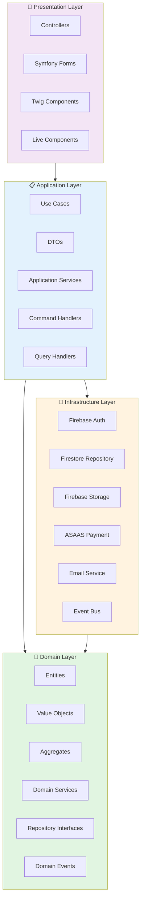

# Arquitetura do Sistema Contatos

## Visão Geral

Este documento descreve a arquitetura futura do sistema de gerenciamento de contatos, que será refatorado seguindo os princípios de **Clean Architecture**, **Domain-Driven Design (DDD) Tático** e utilizando **Symfony 7.x** com **Firebase** como backend.

### Objetivos da Refatoração

1. **Separação de Responsabilidades**: Isolar lógica de negócio da infraestrutura
2. **Testabilidade**: Facilitar testes unitários e de integração
3. **Manutenibilidade**: Código organizado e fácil de evoluir
4. **Escalabilidade**: Preparado para crescimento e novas features
5. **Cloud-Native**: Integração com Firebase/GCP para deploy escalável

## Diagrama de Camadas



## Responsabilidades das Camadas

### 1. Domain Layer (Núcleo)

**Responsabilidades:**
- Contém a lógica de negócio pura
- Define entidades, value objects e aggregates
- Interfaces de repositórios (não implementações)
- Domain services para lógica que não pertence a entidades
- Domain events para comunicação desacoplada
- **ZERO dependências externas** (nem Symfony, nem Firebase)

**Regras:**
- Não conhece detalhes de infraestrutura
- Não depende de frameworks
- É o coração do sistema
- Completamente testável sem mocks pesados

**Exemplo de Entidade:**
```php
namespace App\Domain\Contact\Entity;

use App\Domain\Contact\ValueObject\ContactEmail;
use App\Domain\Contact\ValueObject\ContactPhone;
use App\Domain\Shared\Entity\AggregateRoot;

final class Contact extends AggregateRoot
{
    private ContactId $id;
    private UserId $userId;
    private ContactName $name;
    private ContactEmail $email;
    private ?ContactPhone $phone;
    private ?GeoLocation $location;
    private \DateTimeImmutable $createdAt;
    
    public static function create(
        ContactId $id,
        UserId $userId,
        ContactName $name,
        ContactEmail $email,
        ?ContactPhone $phone = null
    ): self {
        $contact = new self();
        $contact->id = $id;
        $contact->userId = $userId;
        $contact->name = $name;
        $contact->email = $email;
        $contact->phone = $phone;
        $contact->createdAt = new \DateTimeImmutable();
        
        $contact->recordEvent(new ContactCreated($id, $userId));
        
        return $contact;
    }
    
    public function updateEmail(ContactEmail $email): void
    {
        if ($this->email->equals($email)) {
            return;
        }
        
        $this->email = $email;
        $this->recordEvent(new ContactEmailUpdated($this->id, $email));
    }
    
    // ... mais métodos de negócio
}
```

### 2. Application Layer

**Responsabilidades:**
- Orquestra use cases (casos de uso)
- Coordena Domain e Infrastructure
- Define DTOs para entrada/saída
- Implementa Command/Query Handlers (CQRS)
- Gerencia transações e validações de aplicação

**Não contém:**
- Lógica de negócio (está no Domain)
- Detalhes de HTTP/UI (está no Presentation)
- Implementações de persistência (está no Infrastructure)

**Exemplo de Use Case:**
```php
namespace App\Application\Contact\UseCase;

use App\Application\Contact\DTO\CreateContactInput;
use App\Application\Contact\DTO\CreateContactOutput;
use App\Domain\Contact\Entity\Contact;
use App\Domain\Contact\Repository\ContactRepositoryInterface;
use App\Domain\Contact\ValueObject\ContactEmail;
use App\Domain\Contact\ValueObject\ContactName;

final class CreateContactUseCase
{
    public function __construct(
        private ContactRepositoryInterface $contactRepository,
        private ContactIdGenerator $idGenerator
    ) {}
    
    public function execute(CreateContactInput $input): CreateContactOutput
    {
        $id = $this->idGenerator->generate();
        
        $contact = Contact::create(
            $id,
            $input->userId,
            ContactName::fromString($input->name),
            ContactEmail::fromString($input->email),
            $input->phone ? ContactPhone::fromString($input->phone) : null
        );
        
        $this->contactRepository->save($contact);
        
        return CreateContactOutput::fromContact($contact);
    }
}
```

### 3. Infrastructure Layer

**Responsabilidades:**
- Implementações concretas de repositórios
- Integrações com Firebase (Auth, Firestore, Storage)
- Integrações com APIs externas (ASAAS, Email)
- Configurações de framework (Symfony)
- Event Bus e mensageria
- Adapters para serviços externos

**Exemplo de Repository:**
```php
namespace App\Infrastructure\Contact\Persistence;

use App\Domain\Contact\Entity\Contact;
use App\Domain\Contact\Repository\ContactRepositoryInterface;
use Google\Cloud\Firestore\FirestoreClient;

final class FirestoreContactRepository implements ContactRepositoryInterface
{
    private const COLLECTION = 'contacts';
    
    public function __construct(
        private FirestoreClient $firestore,
        private ContactMapper $mapper
    ) {}
    
    public function save(Contact $contact): void
    {
        $data = $this->mapper->toFirestore($contact);
        
        $this->firestore
            ->collection(self::COLLECTION)
            ->document($contact->id()->value())
            ->set($data);
    }
    
    public function findById(ContactId $id): ?Contact
    {
        $doc = $this->firestore
            ->collection(self::COLLECTION)
            ->document($id->value())
            ->snapshot();
            
        if (!$doc->exists()) {
            return null;
        }
        
        return $this->mapper->toDomain($doc->data());
    }
}
```

### 4. Presentation Layer

**Responsabilidades:**
- Controllers HTTP (Symfony)
- Formulários (Symfony Forms)
- Templates (Twig)
- Componentes UI (Twig Components, Live Components)
- Validação de entrada HTTP
- Serialização de resposta

**Não contém:**
- Lógica de negócio (delega para Application)
- Acesso direto ao banco (usa Application/Domain)

**Exemplo de Controller:**
```php
namespace App\Presentation\Contact\Controller;

use App\Application\Contact\UseCase\CreateContactUseCase;
use App\Application\Contact\DTO\CreateContactInput;
use Symfony\Bundle\FrameworkBundle\Controller\AbstractController;
use Symfony\Component\HttpFoundation\Request;
use Symfony\Component\HttpFoundation\Response;
use Symfony\Component\Routing\Annotation\Route;

#[Route('/contacts')]
final class ContactController extends AbstractController
{
    public function __construct(
        private CreateContactUseCase $createContact
    ) {}
    
    #[Route('/create', methods: ['POST'])]
    public function create(Request $request): Response
    {
        $input = new CreateContactInput(
            userId: $this->getUser()->getId(),
            name: $request->request->get('name'),
            email: $request->request->get('email'),
            phone: $request->request->get('phone')
        );
        
        $output = $this->createContact->execute($input);
        
        $this->addFlash('success', 'Contato criado com sucesso!');
        
        return $this->redirectToRoute('contact_show', [
            'id' => $output->id
        ]);
    }
}
```

## Estrutura de Diretórios Detalhada

```
src/
├── Application/                    # Casos de uso e orquestração
│   ├── Contact/
│   │   ├── DTO/
│   │   │   ├── CreateContactInput.php
│   │   │   ├── CreateContactOutput.php
│   │   │   └── UpdateContactInput.php
│   │   ├── UseCase/
│   │   │   ├── CreateContactUseCase.php
│   │   │   ├── UpdateContactUseCase.php
│   │   │   ├── DeleteContactUseCase.php
│   │   │   └── SearchContactsUseCase.php
│   │   └── Service/
│   │       └── ContactApplicationService.php
│   ├── User/
│   │   ├── DTO/
│   │   ├── UseCase/
│   │   └── Service/
│   └── Category/
│       ├── DTO/
│       └── UseCase/
│
├── Domain/                         # Lógica de negócio pura
│   ├── Contact/
│   │   ├── Entity/
│   │   │   ├── Contact.php
│   │   │   └── ContactCategory.php
│   │   ├── ValueObject/
│   │   │   ├── ContactId.php
│   │   │   ├── ContactName.php
│   │   │   ├── ContactEmail.php
│   │   │   ├── ContactPhone.php
│   │   │   └── GeoLocation.php
│   │   ├── Repository/
│   │   │   └── ContactRepositoryInterface.php
│   │   ├── Service/
│   │   │   ├── ContactDuplicateChecker.php
│   │   │   └── GeoLocationService.php
│   │   ├── Event/
│   │   │   ├── ContactCreated.php
│   │   │   ├── ContactUpdated.php
│   │   │   └── ContactDeleted.php
│   │   └── Exception/
│   │       ├── ContactNotFoundException.php
│   │       └── DuplicateContactException.php
│   ├── User/
│   │   ├── Entity/
│   │   │   └── User.php
│   │   ├── ValueObject/
│   │   │   ├── UserId.php
│   │   │   ├── Email.php
│   │   │   └── Password.php
│   │   ├── Repository/
│   │   │   └── UserRepositoryInterface.php
│   │   └── Service/
│   │       └── PasswordHasher.php
│   └── Shared/
│       ├── Entity/
│       │   └── AggregateRoot.php
│       ├── ValueObject/
│       │   ├── DateRange.php
│       │   └── Money.php
│       └── Exception/
│           └── DomainException.php
│
├── Infrastructure/                 # Implementações concretas
│   ├── Firebase/
│   │   ├── Auth/
│   │   │   └── FirebaseAuthAdapter.php
│   │   ├── Firestore/
│   │   │   ├── FirestoreContactRepository.php
│   │   │   ├── FirestoreUserRepository.php
│   │   │   └── Mapper/
│   │   │       ├── ContactMapper.php
│   │   │       └── UserMapper.php
│   │   └── Storage/
│   │       └── FirebaseStorageAdapter.php
│   ├── Payment/
│   │   └── ASAAS/
│   │       └── ASAASPaymentGateway.php
│   ├── Email/
│   │   └── SymfonyMailerAdapter.php
│   ├── EventBus/
│   │   └── SymfonyEventBus.php
│   └── Config/
│       ├── FirebaseConfig.php
│       └── services.yaml
│
├── Presentation/                   # Interface com usuário
│   ├── Web/
│   │   ├── Controller/
│   │   │   ├── Contact/
│   │   │   │   ├── ContactController.php
│   │   │   │   ├── ContactSearchController.php
│   │   │   │   └── ContactExportController.php
│   │   │   ├── User/
│   │   │   │   ├── ProfileController.php
│   │   │   │   └── AuthController.php
│   │   │   └── Dashboard/
│   │   │       └── DashboardController.php
│   │   ├── Form/
│   │   │   ├── ContactType.php
│   │   │   └── UserProfileType.php
│   │   └── Component/
│   │       ├── ContactCard.php
│   │       ├── ContactList.php
│   │       └── SearchBar.php
│   └── Api/
│       └── Controller/
│           └── ContactApiController.php
│
└── Shared/                         # Código compartilhado
    ├── Utils/
    │   ├── Validator.php
    │   └── StringHelper.php
    └── Exception/
        └── ApplicationException.php

config/                             # Configurações Symfony
├── packages/
│   ├── framework.yaml
│   ├── doctrine.yaml
│   └── twig.yaml
├── routes/
│   ├── web.yaml
│   └── api.yaml
└── services.yaml

templates/                          # Templates Twig
├── base.html.twig
├── contact/
│   ├── index.html.twig
│   ├── show.html.twig
│   ├── form.html.twig
│   └── _card.html.twig
└── user/
    ├── profile.html.twig
    └── auth/
        ├── login.html.twig
        └── register.html.twig
```

## Stack Tecnológica Completa

### Backend
- **Framework**: Symfony 7.x
  - Symfony Flex para gerenciamento de receitas
  - Symfony Messenger para filas
  - Symfony Validator para validações
  
- **Linguagem**: PHP 8.3+
  - Type hints estrito
  - Readonly properties
  - Enums para estados

### Frontend
- **Symfony UX**:
  - **Live Components**: Componentes reativos sem JavaScript
  - **Turbo**: Navegação SPA sem refresh completo
  - **Twig Components**: Componentes reutilizáveis
  - **Stimulus**: Sprinkles of JavaScript
  
- **CSS**: Bootstrap 5.3.3
  - Componentes nativos
  - Responsivo mobile-first
  
### Firebase & GCP
- **Firebase Authentication**:
  - Login com Google, Email/Password
  - JWT tokens para autenticação
  - Firebase Admin SDK
  
- **Cloud Firestore**:
  - NoSQL database
  - Realtime updates
  - Queries geoespaciais
  - Indexes customizados
  
- **Firebase Storage**:
  - Upload de imagens de contatos
  - Thumbnails automáticos (Cloud Functions)
  - URLs assinadas para segurança
  
- **GCP Secret Manager**:
  - Gerenciamento de secrets
  - Rotação automática de credenciais

### Pagamentos
- **ASAAS**:
  - Gateway de pagamento brasileiro
  - PIX, Boleto, Cartão de Crédito
  - Webhooks para notificações

### DevOps
- **Containerização**: Docker
  - Multi-stage builds
  - Alpine Linux para imagens leves
  
- **CI/CD**: Google Cloud Build
  - Build automatizado
  - Deploy para Cloud Run
  - Testes automatizados
  
- **Observabilidade**:
  - Google Cloud Logging
  - Cloud Monitoring
  - Error Reporting

## Decisões Arquiteturais

### ADR-001: Por que Clean Architecture?

**Contexto**: Sistema estava acoplado com lógica misturada entre camadas.

**Decisão**: Adotar Clean Architecture com DDD Tático.

**Consequências**:
- ✅ Lógica de negócio isolada e testável
- ✅ Mudanças de infraestrutura não afetam domínio
- ✅ Facilita onboarding de novos desenvolvedores
- ⚠️ Mais arquivos e abstrações (trade-off aceitável)

### ADR-002: Por que Firebase em vez de SQL tradicional?

**Contexto**: Necessidade de escalabilidade e features realtime.

**Decisão**: Migrar para Firebase/Firestore.

**Consequências**:
- ✅ Escalabilidade automática
- ✅ Realtime updates sem complexidade
- ✅ Geo-queries nativas
- ✅ Infraestrutura gerenciada (menos ops)
- ⚠️ Lock-in com GCP (mitigado por interfaces de repositório)
- ⚠️ Custos previsíveis precisam de monitoramento

### ADR-003: Por que Symfony 7.x?

**Contexto**: Sistema atual usa PHP puro com MVC básico.

**Decisão**: Migrar para Symfony 7.x.

**Consequências**:
- ✅ Framework maduro e bem documentado
- ✅ Componentes modulares (use apenas o que precisa)
- ✅ Symfony UX para modernizar frontend sem SPA complexo
- ✅ Excelente integração com Docker e cloud
- ⚠️ Curva de aprendizado inicial

### ADR-004: CQRS (Command Query Responsibility Segregation)

**Contexto**: Necessidade de separar comandos (write) de queries (read).

**Decisão**: Implementar CQRS leve (sem Event Sourcing completo).

**Consequências**:
- ✅ Queries otimizadas independentemente
- ✅ Comandos focados em mudança de estado
- ✅ Mais fácil cachear queries
- ⚠️ Mais classes (handlers separados)

### ADR-005: Event-Driven para integrações

**Contexto**: Necessidade de notificações, emails, webhooks desacoplados.

**Decisão**: Domain Events + Event Bus.

**Consequências**:
- ✅ Desacoplamento de side effects
- ✅ Fácil adicionar novos listeners
- ✅ Auditoria e event log
- ⚠️ Debug pode ser mais complexo (rastreamento de eventos)

## Padrões e Práticas

### Dependency Injection
```php
// services.yaml
services:
    _defaults:
        autowire: true
        autoconfigure: true
    
    App\:
        resource: '../src/'
        exclude:
            - '../src/Domain/*/Entity/'
            - '../src/Domain/*/ValueObject/'
            - '../src/Application/*/DTO/'
```

### Value Objects Imutáveis
```php
final class ContactEmail
{
    private function __construct(private readonly string $value) 
    {
        if (!filter_var($value, FILTER_VALIDATE_EMAIL)) {
            throw new InvalidEmailException($value);
        }
    }
    
    public static function fromString(string $value): self
    {
        return new self($value);
    }
    
    public function value(): string
    {
        return $this->value;
    }
    
    public function equals(self $other): bool
    {
        return $this->value === $other->value;
    }
}
```

### Repository Pattern
```php
interface ContactRepositoryInterface
{
    public function save(Contact $contact): void;
    public function findById(ContactId $id): ?Contact;
    public function findByUser(UserId $userId): array;
    public function delete(ContactId $id): void;
    public function nextIdentity(): ContactId;
}
```

## Testes

### Estrutura de Testes
```
tests/
├── Unit/
│   ├── Domain/
│   │   ├── Contact/
│   │   │   ├── Entity/ContactTest.php
│   │   │   └── ValueObject/ContactEmailTest.php
│   │   └── User/
│   └── Application/
│       └── Contact/
│           └── UseCase/CreateContactUseCaseTest.php
├── Integration/
│   └── Infrastructure/
│       └── Firebase/
│           └── FirestoreContactRepositoryTest.php
└── Functional/
    └── Presentation/
        └── Web/
            └── Controller/ContactControllerTest.php
```

### Exemplo de Teste de Domínio
```php
final class ContactTest extends TestCase
{
    public function test_create_contact_with_valid_data(): void
    {
        $contact = Contact::create(
            ContactId::fromString('123'),
            UserId::fromString('user-1'),
            ContactName::fromString('João Silva'),
            ContactEmail::fromString('joao@example.com')
        );
        
        $this->assertEquals('João Silva', $contact->name()->value());
        $this->assertEquals('joao@example.com', $contact->email()->value());
        $this->assertCount(1, $contact->releaseEvents());
    }
    
    public function test_update_email_records_event(): void
    {
        $contact = $this->createContact();
        
        $contact->updateEmail(ContactEmail::fromString('novo@example.com'));
        
        $events = $contact->releaseEvents();
        $this->assertInstanceOf(ContactEmailUpdated::class, $events[1]);
    }
}
```

## Migração do Sistema Atual

### Estratégia de Migração

1. **Fase 1 - Preparação** (Sprint 1-2):
   - Setup Symfony 7.x
   - Configurar Firebase
   - Criar estrutura de diretórios
   - CI/CD básico

2. **Fase 2 - Domain Layer** (Sprint 3-4):
   - Implementar entidades
   - Criar value objects
   - Definir interfaces de repositórios
   - Testes unitários de domínio

3. **Fase 3 - Infrastructure** (Sprint 5-6):
   - Implementar repositórios Firestore
   - Firebase Auth adapter
   - Firebase Storage
   - Testes de integração

4. **Fase 4 - Application Layer** (Sprint 7-8):
   - Use cases principais
   - DTOs
   - Command/Query handlers

5. **Fase 5 - Presentation** (Sprint 9-10):
   - Controllers Symfony
   - Templates Twig
   - Symfony UX components
   - Migrar rotas

6. **Fase 6 - Cutover** (Sprint 11-12):
   - Migração de dados
   - Testes end-to-end
   - Deploy gradual (feature flags)
   - Monitoramento

### Compatibilidade Durante Migração

- Manter API atual funcionando
- Novo código em namespace separado
- Feature flags para testar novo fluxo
- Rollback fácil em caso de problemas

## Referências

- [Clean Architecture - Robert C. Martin](https://blog.cleancoder.com/uncle-bob/2012/08/13/the-clean-architecture.html)
- [Domain-Driven Design - Eric Evans](https://www.domainlanguage.com/ddd/)
- [Symfony Best Practices](https://symfony.com/doc/current/best_practices.html)
- [Firebase Documentation](https://firebase.google.com/docs)
- [Tactical DDD with Symfony](https://symfonycasts.com/screencast/solid)

## Próximos Passos

1. ✅ Documentação completa (este arquivo)
2. 📋 [docs/FIREBASE_SETUP.md](./FIREBASE_SETUP.md) - Guia Firebase
3. 📋 [docs/DDD_GUIDE.md](./DDD_GUIDE.md) - Guia DDD
4. 📋 [docs/LAYERS_FLOW.md](./LAYERS_FLOW.md) - Fluxos entre camadas
5. 🔄 Limpeza do projeto atual
6. 🚀 Início da implementação
