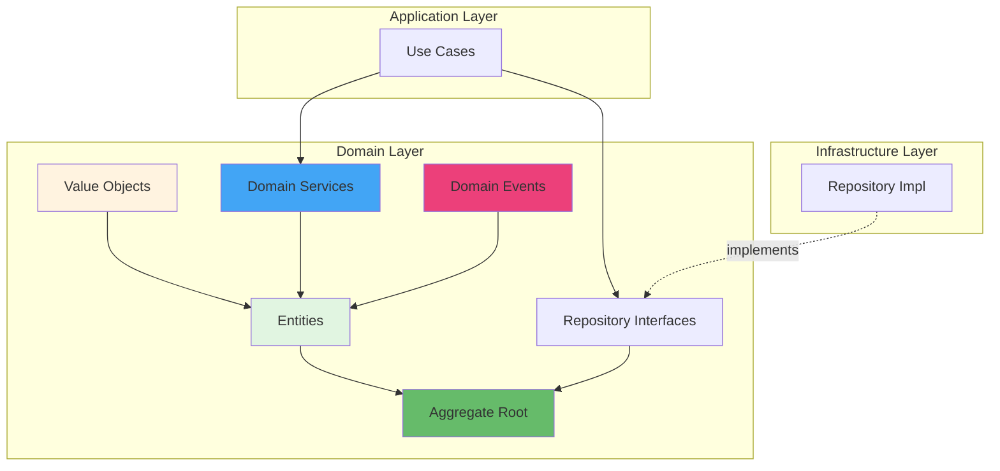

# Guia de Domain-Driven Design Tático

Este documento explica os conceitos de DDD Tático aplicados ao sistema de contatos e fornece exemplos práticos de implementação.

## Índice

1. [Introdução ao DDD Tático](#introdução-ao-ddd-tático)
2. [Building Blocks](#building-blocks)
3. [Entities](#entities)
4. [Value Objects](#value-objects)
5. [Aggregates](#aggregates)
6. [Repository Pattern](#repository-pattern)
7. [Domain Services](#domain-services)
8. [Domain Events](#domain-events)
9. [Especificações](#especificações)
10. [Exemplos Práticos](#exemplos-práticos)

## Introdução ao DDD Tático

Domain-Driven Design (DDD) Tático foca nos **building blocks** que compõem o modelo de domínio. Enquanto o DDD Estratégico trata de bounded contexts e context mapping, o DDD Tático se concentra na implementação detalhada dentro de cada contexto.

### Princípios Fundamentais

1. **Linguagem Ubíqua**: Código reflete a linguagem do negócio
2. **Domain Model**: Lógica de negócio isolada de infraestrutura
3. **Aggregate Boundaries**: Limites de consistência transacional
4. **Imutabilidade**: Value Objects imutáveis
5. **Encapsulamento**: Estado protegido, mudanças via métodos



## Building Blocks

### Visão Geral dos Blocos

| Building Block | Identidade | Mutabilidade | Propósito |
|----------------|------------|--------------|-----------|
| **Entity** | Sim (ID único) | Mutável | Representar conceitos com ciclo de vida |
| **Value Object** | Não | Imutável | Representar atributos descritivos |
| **Aggregate** | Sim (Root é Entity) | Mutável | Garantir consistência transacional |
| **Repository** | N/A | N/A | Abstrair persistência de Aggregates |
| **Domain Service** | N/A | Stateless | Lógica que não pertence a Entity |
| **Domain Event** | Sim | Imutável | Notificar mudanças no domínio |

## Entities

### Definição

**Entities** são objetos definidos por sua **identidade**, não por seus atributos. Duas entities com os mesmos atributos mas IDs diferentes são distintas.

### Características

- ✅ Possui identidade única (ID)
- ✅ Mutável (estado pode mudar)
- ✅ Tem ciclo de vida (criado, modificado, deletado)
- ✅ Comparadas por identidade (não por valor)

### Exemplo: Contact Entity

```php
namespace App\Domain\Contact\Entity;

use App\Domain\Contact\ValueObject\ContactEmail;
use App\Domain\Contact\ValueObject\ContactId;
use App\Domain\Contact\ValueObject\ContactName;
use App\Domain\Contact\ValueObject\ContactPhone;
use App\Domain\Shared\Entity\AggregateRoot;

final class Contact extends AggregateRoot
{
    private ContactId $id;
    private UserId $userId;
    private ContactName $name;
    private ContactEmail $email;
    private ?ContactPhone $phone;
    private ?CategoryId $categoryId;
    private ?GeoLocation $location;
    private ?ContactAddress $address;
    private string $notes;
    private bool $isFavorite;
    private \DateTimeImmutable $createdAt;
    private \DateTimeImmutable $updatedAt;
    
    /**
     * Factory method para criar novo contato
     */
    public static function create(
        ContactId $id,
        UserId $userId,
        ContactName $name,
        ContactEmail $email,
        ?ContactPhone $phone = null
    ): self {
        $contact = new self();
        $contact->id = $id;
        $contact->userId = $userId;
        $contact->name = $name;
        $contact->email = $email;
        $contact->phone = $phone;
        $contact->categoryId = null;
        $contact->location = null;
        $contact->address = null;
        $contact->notes = '';
        $contact->isFavorite = false;
        $contact->createdAt = new \DateTimeImmutable();
        $contact->updatedAt = new \DateTimeImmutable();
        
        // Registrar evento de domínio
        $contact->recordEvent(new ContactCreated(
            $id,
            $userId,
            $name,
            $email
        ));
        
        return $contact;
    }
    
    /**
     * Reconstruir entidade a partir de dados persistidos
     */
    public static function fromPrimitives(
        string $id,
        string $userId,
        string $name,
        string $email,
        ?string $phone,
        ?string $categoryId,
        ?array $location,
        ?array $address,
        string $notes,
        bool $isFavorite,
        string $createdAt,
        string $updatedAt
    ): self {
        $contact = new self();
        $contact->id = ContactId::fromString($id);
        $contact->userId = UserId::fromString($userId);
        $contact->name = ContactName::fromString($name);
        $contact->email = ContactEmail::fromString($email);
        $contact->phone = $phone ? ContactPhone::fromString($phone) : null;
        $contact->categoryId = $categoryId ? CategoryId::fromString($categoryId) : null;
        $contact->location = $location ? GeoLocation::fromArray($location) : null;
        $contact->address = $address ? ContactAddress::fromArray($address) : null;
        $contact->notes = $notes;
        $contact->isFavorite = $isFavorite;
        $contact->createdAt = new \DateTimeImmutable($createdAt);
        $contact->updatedAt = new \DateTimeImmutable($updatedAt);
        
        return $contact;
    }
    
    // Métodos de negócio (comportamento)
    
    public function updateBasicInfo(
        ContactName $name,
        ContactEmail $email,
        ?ContactPhone $phone
    ): void {
        $hasChanges = false;
        
        if (!$this->name->equals($name)) {
            $this->name = $name;
            $hasChanges = true;
        }
        
        if (!$this->email->equals($email)) {
            $this->email = $email;
            $hasChanges = true;
            
            $this->recordEvent(new ContactEmailChanged(
                $this->id,
                $email
            ));
        }
        
        if ($phone && !$this->phone?->equals($phone)) {
            $this->phone = $phone;
            $hasChanges = true;
        }
        
        if ($hasChanges) {
            $this->updatedAt = new \DateTimeImmutable();
            $this->recordEvent(new ContactUpdated($this->id));
        }
    }
    
    public function setLocation(GeoLocation $location): void
    {
        $this->location = $location;
        $this->updatedAt = new \DateTimeImmutable();
        
        $this->recordEvent(new ContactLocationUpdated(
            $this->id,
            $location
        ));
    }
    
    public function assignToCategory(?CategoryId $categoryId): void
    {
        if ($this->categoryId?->equals($categoryId)) {
            return; // Sem mudança
        }
        
        $oldCategory = $this->categoryId;
        $this->categoryId = $categoryId;
        $this->updatedAt = new \DateTimeImmutable();
        
        $this->recordEvent(new ContactCategoryChanged(
            $this->id,
            $oldCategory,
            $categoryId
        ));
    }
    
    public function markAsFavorite(): void
    {
        if ($this->isFavorite) {
            return;
        }
        
        $this->isFavorite = true;
        $this->updatedAt = new \DateTimeImmutable();
        
        $this->recordEvent(new ContactMarkedAsFavorite($this->id));
    }
    
    public function unmarkAsFavorite(): void
    {
        if (!$this->isFavorite) {
            return;
        }
        
        $this->isFavorite = false;
        $this->updatedAt = new \DateTimeImmutable();
        
        $this->recordEvent(new ContactUnmarkedAsFavorite($this->id));
    }
    
    // Getters (somente leitura)
    
    public function id(): ContactId
    {
        return $this->id;
    }
    
    public function userId(): UserId
    {
        return $this->userId;
    }
    
    public function name(): ContactName
    {
        return $this->name;
    }
    
    public function email(): ContactEmail
    {
        return $this->email;
    }
    
    public function phone(): ?ContactPhone
    {
        return $this->phone;
    }
    
    public function categoryId(): ?CategoryId
    {
        return $this->categoryId;
    }
    
    public function location(): ?GeoLocation
    {
        return $this->location;
    }
    
    public function isFavorite(): bool
    {
        return $this->isFavorite;
    }
    
    // Comparação por identidade
    
    public function equals(self $other): bool
    {
        return $this->id->equals($other->id);
    }
}
```

### Quando Usar Entity

✅ **Use Entity quando:**
- Objeto tem identidade única
- Você precisa rastrear mudanças ao longo do tempo
- Objeto tem ciclo de vida (criado, modificado, deletado)
- Dois objetos com mesmos atributos devem ser diferentes

❌ **Não use Entity quando:**
- Objeto é definido apenas por seus atributos
- Não há necessidade de rastrear mudanças
- Imutabilidade é mais importante

## Value Objects

### Definição

**Value Objects** são objetos definidos por seus **atributos**, não por identidade. Dois value objects com os mesmos atributos são considerados iguais.

### Características

- ✅ **Imutável**: Uma vez criado, não muda
- ✅ **Sem identidade**: Comparados por valor
- ✅ **Auto-validação**: Valida na criação
- ✅ **Substituíveis**: Troca completa em vez de modificação
- ✅ **Reutilizáveis**: Podem ser compartilhados

### Exemplo: ContactEmail Value Object

```php
namespace App\Domain\Contact\ValueObject;

use App\Domain\Shared\Exception\InvalidArgumentException;

final class ContactEmail
{
    private const MAX_LENGTH = 255;
    
    private function __construct(
        private readonly string $value
    ) {
        $this->validate();
    }
    
    public static function fromString(string $value): self
    {
        return new self(trim($value));
    }
    
    private function validate(): void
    {
        if (empty($this->value)) {
            throw new InvalidArgumentException('Email cannot be empty');
        }
        
        if (strlen($this->value) > self::MAX_LENGTH) {
            throw new InvalidArgumentException(
                sprintf('Email cannot exceed %d characters', self::MAX_LENGTH)
            );
        }
        
        if (!filter_var($this->value, FILTER_VALIDATE_EMAIL)) {
            throw new InvalidArgumentException(
                sprintf('"%s" is not a valid email address', $this->value)
            );
        }
    }
    
    public function value(): string
    {
        return $this->value;
    }
    
    public function domain(): string
    {
        return substr($this->value, strpos($this->value, '@') + 1);
    }
    
    public function localPart(): string
    {
        return substr($this->value, 0, strpos($this->value, '@'));
    }
    
    public function equals(self $other): bool
    {
        return strtolower($this->value) === strtolower($other->value);
    }
    
    public function __toString(): string
    {
        return $this->value;
    }
}
```

### Exemplo: ContactPhone Value Object

```php
namespace App\Domain\Contact\ValueObject;

final class ContactPhone
{
    private function __construct(
        private readonly string $value,
        private readonly string $countryCode,
        private readonly string $areaCode,
        private readonly string $number
    ) {}
    
    public static function fromString(string $value): self
    {
        $cleaned = preg_replace('/[^0-9]/', '', $value);
        
        if (strlen($cleaned) < 10 || strlen($cleaned) > 15) {
            throw new InvalidArgumentException('Invalid phone number length');
        }
        
        // Parse brasileiro: +55 (11) 98765-4321
        if (strlen($cleaned) === 11 && str_starts_with($cleaned, '55')) {
            $countryCode = '55';
            $areaCode = substr($cleaned, 2, 2);
            $number = substr($cleaned, 4);
        } elseif (strlen($cleaned) === 11) {
            // (11) 98765-4321
            $countryCode = '55';
            $areaCode = substr($cleaned, 0, 2);
            $number = substr($cleaned, 2);
        } else {
            // Internacional genérico
            $countryCode = substr($cleaned, 0, strlen($cleaned) - 10);
            $areaCode = substr($cleaned, -10, 3);
            $number = substr($cleaned, -7);
        }
        
        return new self($cleaned, $countryCode, $areaCode, $number);
    }
    
    public function value(): string
    {
        return $this->value;
    }
    
    public function formatted(): string
    {
        if ($this->countryCode === '55' && strlen($this->number) === 9) {
            // Formato brasileiro: +55 (11) 98765-4321
            return sprintf(
                '+%s (%s) %s-%s',
                $this->countryCode,
                $this->areaCode,
                substr($this->number, 0, 5),
                substr($this->number, 5)
            );
        }
        
        return sprintf('+%s %s %s', $this->countryCode, $this->areaCode, $this->number);
    }
    
    public function equals(self $other): bool
    {
        return $this->value === $other->value;
    }
    
    public function __toString(): string
    {
        return $this->formatted();
    }
}
```

### Exemplo: GeoLocation Value Object

```php
namespace App\Domain\Contact\ValueObject;

final class GeoLocation
{
    private const EARTH_RADIUS_KM = 6371;
    
    private function __construct(
        private readonly float $latitude,
        private readonly float $longitude
    ) {
        $this->validate();
    }
    
    public static function fromCoordinates(float $latitude, float $longitude): self
    {
        return new self($latitude, $longitude);
    }
    
    public static function fromArray(array $data): self
    {
        if (!isset($data['latitude']) || !isset($data['longitude'])) {
            throw new InvalidArgumentException('Missing latitude or longitude');
        }
        
        return new self(
            (float) $data['latitude'],
            (float) $data['longitude']
        );
    }
    
    private function validate(): void
    {
        if ($this->latitude < -90 || $this->latitude > 90) {
            throw new InvalidArgumentException(
                'Latitude must be between -90 and 90'
            );
        }
        
        if ($this->longitude < -180 || $this->longitude > 180) {
            throw new InvalidArgumentException(
                'Longitude must be between -180 and 180'
            );
        }
    }
    
    public function latitude(): float
    {
        return $this->latitude;
    }
    
    public function longitude(): float
    {
        return $this->longitude;
    }
    
    /**
     * Calcula distância para outra localização usando fórmula de Haversine
     */
    public function distanceTo(self $other): float
    {
        $latFrom = deg2rad($this->latitude);
        $lonFrom = deg2rad($this->longitude);
        $latTo = deg2rad($other->latitude);
        $lonTo = deg2rad($other->longitude);
        
        $latDelta = $latTo - $latFrom;
        $lonDelta = $lonTo - $lonFrom;
        
        $a = sin($latDelta / 2) ** 2 + 
             cos($latFrom) * cos($latTo) * 
             sin($lonDelta / 2) ** 2;
        
        $c = 2 * atan2(sqrt($a), sqrt(1 - $a));
        
        return self::EARTH_RADIUS_KM * $c;
    }
    
    public function isWithinRadius(self $center, float $radiusKm): bool
    {
        return $this->distanceTo($center) <= $radiusKm;
    }
    
    public function equals(self $other): bool
    {
        return abs($this->latitude - $other->latitude) < 0.000001
            && abs($this->longitude - $other->longitude) < 0.000001;
    }
    
    public function toArray(): array
    {
        return [
            'latitude' => $this->latitude,
            'longitude' => $this->longitude
        ];
    }
}
```

### Quando Usar Value Object

✅ **Use Value Object quando:**
- Objeto é definido por seus atributos
- Imutabilidade é importante
- Precisa de validação complexa
- Comportamento rico relacionado ao valor
- Pode ser compartilhado entre entities

❌ **Não use Value Object quando:**
- Precisa de identidade única
- Precisa rastrear mudanças
- Mutabilidade é necessária

## Aggregates

### Definição

**Aggregate** é um cluster de objetos (Entities + Value Objects) tratados como uma única unidade para mudanças de dados. Tem um **Aggregate Root** (sempre uma Entity) que é o único ponto de entrada.

### Características

- ✅ **Boundary de consistência**: Garante invariantes
- ✅ **Transacional**: Salvo/carregado como unidade
- ✅ **Root única**: Acesso apenas via root
- ✅ **Referências por ID**: Aggregates se referenciam por ID, não objetos

### Regras de Aggregates

1. **Aggregate Root é o único entry point**
   - Objetos internos não são acessíveis diretamente
   
2. **Referências entre Aggregates são por ID**
   - Não manter referências de objeto diretas
   
3. **Transação por Aggregate**
   - Uma transação modifica apenas um Aggregate
   
4. **Pequenos e coesos**
   - Apenas o que precisa de consistência imediata

### Exemplo: Contact Aggregate

```php
namespace App\Domain\Contact\Entity;

use App\Domain\Shared\Entity\AggregateRoot;

/**
 * Contact é o Aggregate Root
 * 
 * Aggregate = Contact + ContactAddress + Tags
 * Boundary: Tudo que precisa de consistência imediata
 */
final class Contact extends AggregateRoot
{
    private ContactId $id;
    private UserId $userId; // Referência por ID, não objeto User
    private ContactName $name;
    private ContactEmail $email;
    private ?ContactAddress $address; // Parte do aggregate
    private array $tags; // Coleção de Value Objects
    
    // ... 
    
    /**
     * Método de negócio que garante invariante
     */
    public function updateAddress(ContactAddress $address): void
    {
        // Invariante: Se tem endereço, deve ter location
        if (!$address->hasCoordinates()) {
            throw new DomainException(
                'Address must have coordinates'
            );
        }
        
        $this->address = $address;
        $this->location = $address->location();
        $this->updatedAt = new \DateTimeImmutable();
        
        $this->recordEvent(new ContactAddressUpdated($this->id, $address));
    }
    
    /**
     * Tags fazem parte do aggregate (consistência imediata)
     */
    public function addTag(Tag $tag): void
    {
        // Invariante: Máximo 10 tags
        if (count($this->tags) >= 10) {
            throw new DomainException('Contact cannot have more than 10 tags');
        }
        
        // Invariante: Tag única
        foreach ($this->tags as $existingTag) {
            if ($existingTag->equals($tag)) {
                return; // Já existe
            }
        }
        
        $this->tags[] = $tag;
        $this->recordEvent(new ContactTagAdded($this->id, $tag));
    }
    
    public function removeTag(Tag $tag): void
    {
        $this->tags = array_filter(
            $this->tags,
            fn($t) => !$t->equals($tag)
        );
        
        $this->recordEvent(new ContactTagRemoved($this->id, $tag));
    }
}
```

### Exemplo: User Aggregate

```php
namespace App\Domain\User\Entity;

/**
 * User é outro Aggregate Root
 * 
 * Aggregate = User + Subscription + Preferences
 */
final class User extends AggregateRoot
{
    private UserId $id;
    private Email $email;
    private HashedPassword $password;
    private UserProfile $profile;
    private ?Subscription $subscription; // Parte do aggregate
    private UserPreferences $preferences; // Parte do aggregate
    
    public static function register(
        UserId $id,
        Email $email,
        Password $password,
        string $displayName
    ): self {
        $user = new self();
        $user->id = $id;
        $user->email = $email;
        $user->password = HashedPassword::fromPlainPassword($password);
        $user->profile = UserProfile::create($displayName);
        $user->subscription = null;
        $user->preferences = UserPreferences::default();
        
        $user->recordEvent(new UserRegistered($id, $email));
        
        return $user;
    }
    
    public function upgradeSubscription(
        SubscriptionPlan $plan,
        \DateTimeImmutable $expiresAt
    ): void {
        // Invariante: Só pode fazer upgrade se não tem subscription ativa
        if ($this->subscription && $this->subscription->isActive()) {
            throw new DomainException('User already has active subscription');
        }
        
        $this->subscription = Subscription::create($plan, $expiresAt);
        
        $this->recordEvent(new UserSubscriptionUpgraded(
            $this->id,
            $plan
        ));
    }
    
    // Contact NÃO faz parte do aggregate User
    // Relacionamento é por ID (userId em Contact)
}
```

### Aggregate vs Entity

| Aspecto | Entity | Aggregate |
|---------|--------|-----------|
| **Definição** | Objeto com identidade | Cluster de objetos |
| **Root** | Pode ser root ou não | Sempre tem um root |
| **Transação** | Pode ser parte | Define boundary transacional |
| **Consistência** | Individual | Garante invariantes do grupo |

## Repository Pattern

### Definição

**Repository** abstrai o acesso a dados de um Aggregate. Funciona como uma coleção em memória do ponto de vista do domínio.

### Características

- ✅ **Um Repository por Aggregate Root**
- ✅ **Interface no Domain Layer**
- ✅ **Implementação no Infrastructure Layer**
- ✅ **Retorna Aggregates completos**
- ✅ **Abstrai detalhes de persistência**

### Interface do Repository

```php
namespace App\Domain\Contact\Repository;

use App\Domain\Contact\Entity\Contact;
use App\Domain\Contact\ValueObject\ContactId;
use App\Domain\User\ValueObject\UserId;

interface ContactRepositoryInterface
{
    /**
     * Salva um aggregate (insert ou update)
     */
    public function save(Contact $contact): void;
    
    /**
     * Busca por ID (retorna aggregate completo ou null)
     */
    public function findById(ContactId $id): ?Contact;
    
    /**
     * Busca múltiplos contatos de um usuário
     */
    public function findByUser(UserId $userId, int $limit = 50): array;
    
    /**
     * Busca com critérios
     */
    public function findByCriteria(ContactSearchCriteria $criteria): array;
    
    /**
     * Remove um aggregate
     */
    public function delete(ContactId $id): void;
    
    /**
     * Gera próxima identidade
     */
    public function nextIdentity(): ContactId;
    
    /**
     * Verifica se existe
     */
    public function exists(ContactId $id): bool;
}
```

### Implementação Firestore

```php
namespace App\Infrastructure\Firebase\Firestore;

use App\Domain\Contact\Repository\ContactRepositoryInterface;
use Google\Cloud\Firestore\FirestoreClient;

final class FirestoreContactRepository implements ContactRepositoryInterface
{
    private const COLLECTION = 'contacts';
    
    public function __construct(
        private FirestoreClient $firestore,
        private ContactFirestoreMapper $mapper
    ) {}
    
    public function save(Contact $contact): void
    {
        $data = $this->mapper->toFirestore($contact);
        
        // Salvar aggregate completo (incluindo address, tags, etc)
        $this->firestore
            ->collection(self::COLLECTION)
            ->document($contact->id()->value())
            ->set($data, ['merge' => true]);
        
        // Processar eventos de domínio
        foreach ($contact->releaseEvents() as $event) {
            // Event bus dispatch...
        }
    }
    
    public function findById(ContactId $id): ?Contact
    {
        $snapshot = $this->firestore
            ->collection(self::COLLECTION)
            ->document($id->value())
            ->snapshot();
        
        if (!$snapshot->exists()) {
            return null;
        }
        
        // Reconstruir aggregate completo
        return $this->mapper->toDomain($snapshot->data(), $snapshot->id());
    }
    
    public function nextIdentity(): ContactId
    {
        return ContactId::generate();
    }
    
    // ... outros métodos
}
```

### Repository vs DAO

| Aspecto | Repository | DAO (Data Access Object) |
|---------|------------|--------------------------|
| **Foco** | Aggregate (domínio) | Tabela/Coleção |
| **Retorno** | Entities/Aggregates | Arrays/DTOs |
| **Localização** | Interface no Domain | Tudo em Infrastructure |
| **Abstração** | Coleção em memória | Acesso a dados |
| **Lógica** | Pode ter queries complexas | CRUD simples |

## Domain Services

### Definição

**Domain Service** contém lógica de domínio que:
- Não pertence naturalmente a uma Entity
- Opera em múltiplas Entities
- É stateless (sem estado próprio)

### Quando Usar Domain Service

✅ **Use quando:**
- Lógica envolve múltiplas entities
- Operação não é responsabilidade de nenhuma entity específica
- Comportamento é parte da linguagem ubíqua

❌ **Não use quando:**
- Lógica pertence claramente a uma entity
- É apenas orquestração (isso é Application Service)

### Exemplo: ContactDuplicateChecker

```php
namespace App\Domain\Contact\Service;

use App\Domain\Contact\Entity\Contact;
use App\Domain\Contact\Repository\ContactRepositoryInterface;
use App\Domain\Contact\ValueObject\ContactEmail;
use App\Domain\User\ValueObject\UserId;

/**
 * Domain Service para verificar duplicatas
 * 
 * Não pertence a Contact porque precisa consultar repositório
 */
final class ContactDuplicateChecker
{
    public function __construct(
        private ContactRepositoryInterface $repository
    ) {}
    
    public function isDuplicate(
        UserId $userId,
        ContactEmail $email,
        ?ContactId $excludeId = null
    ): bool {
        $contacts = $this->repository->findByUserAndEmail($userId, $email);
        
        // Se excludeId informado, remover da verificação (para updates)
        if ($excludeId) {
            $contacts = array_filter(
                $contacts,
                fn($c) => !$c->id()->equals($excludeId)
            );
        }
        
        return count($contacts) > 0;
    }
    
    public function findSimilar(Contact $contact, float $threshold = 0.8): array
    {
        $allContacts = $this->repository->findByUser($contact->userId());
        
        $similar = [];
        foreach ($allContacts as $candidate) {
            if ($candidate->id()->equals($contact->id())) {
                continue;
            }
            
            $similarity = $this->calculateSimilarity($contact, $candidate);
            
            if ($similarity >= $threshold) {
                $similar[] = [
                    'contact' => $candidate,
                    'similarity' => $similarity
                ];
            }
        }
        
        // Ordenar por similaridade
        usort($similar, fn($a, $b) => $b['similarity'] <=> $a['similarity']);
        
        return $similar;
    }
    
    private function calculateSimilarity(Contact $a, Contact $b): float
    {
        $score = 0;
        
        // Nome similar
        $nameScore = $this->levenshteinNormalized(
            $a->name()->value(),
            $b->name()->value()
        );
        $score += $nameScore * 0.4;
        
        // Email igual
        if ($a->email()->equals($b->email())) {
            $score += 0.3;
        }
        
        // Telefone igual
        if ($a->phone() && $b->phone() && $a->phone()->equals($b->phone())) {
            $score += 0.3;
        }
        
        return $score;
    }
    
    private function levenshteinNormalized(string $a, string $b): float
    {
        $maxLen = max(strlen($a), strlen($b));
        if ($maxLen === 0) {
            return 1.0;
        }
        
        $distance = levenshtein(strtolower($a), strtolower($b));
        return 1 - ($distance / $maxLen);
    }
}
```

### Exemplo: GeoLocationService

```php
namespace App\Domain\Contact\Service;

/**
 * Domain Service para operações geoespaciais
 */
final class GeoLocationService
{
    /**
     * Encontra contatos próximos a uma localização
     */
    public function findNearby(
        array $contacts,
        GeoLocation $center,
        float $radiusKm
    ): array {
        $nearby = [];
        
        foreach ($contacts as $contact) {
            if (!$contact->location()) {
                continue;
            }
            
            $distance = $contact->location()->distanceTo($center);
            
            if ($distance <= $radiusKm) {
                $nearby[] = [
                    'contact' => $contact,
                    'distance' => $distance
                ];
            }
        }
        
        // Ordenar por distância
        usort($nearby, fn($a, $b) => $a['distance'] <=> $b['distance']);
        
        return $nearby;
    }
    
    /**
     * Calcula centro geográfico de múltiplos contatos
     */
    public function calculateCenter(array $contacts): ?GeoLocation
    {
        $locations = array_filter(
            array_map(fn($c) => $c->location(), $contacts)
        );
        
        if (empty($locations)) {
            return null;
        }
        
        $sumLat = 0;
        $sumLon = 0;
        
        foreach ($locations as $location) {
            $sumLat += $location->latitude();
            $sumLon += $location->longitude();
        }
        
        return GeoLocation::fromCoordinates(
            $sumLat / count($locations),
            $sumLon / count($locations)
        );
    }
}
```

## Domain Events

### Definição

**Domain Events** são objetos imutáveis que representam algo que aconteceu no domínio. São usados para comunicação desacoplada.

### Características

- ✅ **Imutável**: Não muda após criação
- ✅ **Passado**: Nome no passado (ContactCreated, não CreateContact)
- ✅ **Rico em informações**: Contém dados relevantes
- ✅ **Identificável**: Tem ID e timestamp
- ✅ **Serializable**: Pode ser persistido

### Exemplo: ContactCreated Event

```php
namespace App\Domain\Contact\Event;

use App\Domain\Shared\Event\DomainEvent;

final class ContactCreated implements DomainEvent
{
    private string $eventId;
    private \DateTimeImmutable $occurredOn;
    
    public function __construct(
        private readonly ContactId $contactId,
        private readonly UserId $userId,
        private readonly ContactName $name,
        private readonly ContactEmail $email
    ) {
        $this->eventId = uuid_create();
        $this->occurredOn = new \DateTimeImmutable();
    }
    
    public function eventId(): string
    {
        return $this->eventId;
    }
    
    public function occurredOn(): \DateTimeImmutable
    {
        return $this->occurredOn;
    }
    
    public function contactId(): ContactId
    {
        return $this->contactId;
    }
    
    public function userId(): UserId
    {
        return $this->userId;
    }
    
    public function name(): ContactName
    {
        return $this->name;
    }
    
    public function email(): ContactEmail
    {
        return $this->email;
    }
    
    public function toArray(): array
    {
        return [
            'eventId' => $this->eventId,
            'occurredOn' => $this->occurredOn->format('c'),
            'contactId' => $this->contactId->value(),
            'userId' => $this->userId->value(),
            'name' => $this->name->value(),
            'email' => $this->email->value(),
        ];
    }
    
    public static function fromArray(array $data): self
    {
        $event = new self(
            ContactId::fromString($data['contactId']),
            UserId::fromString($data['userId']),
            ContactName::fromString($data['name']),
            ContactEmail::fromString($data['email'])
        );
        
        $event->eventId = $data['eventId'];
        $event->occurredOn = new \DateTimeImmutable($data['occurredOn']);
        
        return $event;
    }
}
```

### Aggregate Root com Eventos

```php
namespace App\Domain\Shared\Entity;

abstract class AggregateRoot
{
    private array $events = [];
    
    /**
     * Registra evento de domínio
     */
    protected function recordEvent(DomainEvent $event): void
    {
        $this->events[] = $event;
    }
    
    /**
     * Retorna e limpa eventos
     */
    public function releaseEvents(): array
    {
        $events = $this->events;
        $this->events = [];
        return $events;
    }
    
    /**
     * Verifica se há eventos pendentes
     */
    public function hasEvents(): bool
    {
        return !empty($this->events);
    }
}
```

### Event Listeners (Application Layer)

```php
namespace App\Application\Contact\EventListener;

use App\Domain\Contact\Event\ContactCreated;
use App\Infrastructure\Email\EmailService;

final class SendWelcomeEmailOnContactCreated
{
    public function __construct(
        private EmailService $emailService
    ) {}
    
    public function __invoke(ContactCreated $event): void
    {
        // Side effect: enviar email
        $this->emailService->send(
            to: $event->email()->value(),
            subject: 'Contato adicionado',
            template: 'contact_welcome',
            data: [
                'contactName' => $event->name()->value()
            ]
        );
    }
}
```

## Especificações

### Definição

**Specification Pattern** encapsula regras de negócio complexas em objetos reutilizáveis.

### Exemplo: ContactSpecifications

```php
namespace App\Domain\Contact\Specification;

use App\Domain\Contact\Entity\Contact;

interface ContactSpecificationInterface
{
    public function isSatisfiedBy(Contact $contact): bool;
}

final class IsFavoriteSpecification implements ContactSpecificationInterface
{
    public function isSatisfiedBy(Contact $contact): bool
    {
        return $contact->isFavorite();
    }
}

final class HasLocationSpecification implements ContactSpecificationInterface
{
    public function isSatisfiedBy(Contact $contact): bool
    {
        return $contact->location() !== null;
    }
}

final class IsInCategorySpecification implements ContactSpecificationInterface
{
    public function __construct(
        private CategoryId $categoryId
    ) {}
    
    public function isSatisfiedBy(Contact $contact): bool
    {
        return $contact->categoryId()?->equals($this->categoryId) ?? false;
    }
}

// Specifications compostas
final class AndSpecification implements ContactSpecificationInterface
{
    public function __construct(
        private ContactSpecificationInterface $left,
        private ContactSpecificationInterface $right
    ) {}
    
    public function isSatisfiedBy(Contact $contact): bool
    {
        return $this->left->isSatisfiedBy($contact) 
            && $this->right->isSatisfiedBy($contact);
    }
}
```

### Uso de Specifications

```php
// Buscar contatos favoritos com localização
$spec = new AndSpecification(
    new IsFavoriteSpecification(),
    new HasLocationSpecification()
);

$contacts = $repository->findByUser($userId);
$filtered = array_filter($contacts, fn($c) => $spec->isSatisfiedBy($c));
```

## Exemplos Práticos

### Caso Completo: Criar Contato

```php
// 1. Use Case (Application Layer)
namespace App\Application\Contact\UseCase;

final class CreateContactUseCase
{
    public function __construct(
        private ContactRepositoryInterface $repository,
        private ContactDuplicateChecker $duplicateChecker
    ) {}
    
    public function execute(CreateContactInput $input): CreateContactOutput
    {
        // Validar unicidade (Domain Service)
        $email = ContactEmail::fromString($input->email);
        
        if ($this->duplicateChecker->isDuplicate($input->userId, $email)) {
            throw new DuplicateContactException('Contact with this email already exists');
        }
        
        // Criar aggregate
        $id = $this->repository->nextIdentity();
        
        $contact = Contact::create(
            $id,
            $input->userId,
            ContactName::fromString($input->name),
            $email,
            $input->phone ? ContactPhone::fromString($input->phone) : null
        );
        
        // Salvar aggregate
        $this->repository->save($contact);
        
        // Eventos serão processados aqui
        
        return CreateContactOutput::fromContact($contact);
    }
}

// 2. Controller (Presentation Layer)
namespace App\Presentation\Web\Controller\Contact;

#[Route('/contacts')]
final class ContactController extends AbstractController
{
    public function __construct(
        private CreateContactUseCase $createContact
    ) {}
    
    #[Route('/create', methods: ['POST'])]
    public function create(Request $request): Response
    {
        $input = new CreateContactInput(
            userId: UserId::fromString($this->getUser()->getId()),
            name: $request->request->get('name'),
            email: $request->request->get('email'),
            phone: $request->request->get('phone')
        );
        
        try {
            $output = $this->createContact->execute($input);
            
            $this->addFlash('success', 'Contato criado com sucesso!');
            
            return $this->redirectToRoute('contact_show', [
                'id' => $output->id
            ]);
        } catch (DuplicateContactException $e) {
            $this->addFlash('error', $e->getMessage());
            return $this->redirectToRoute('contact_new');
        }
    }
}
```

## Boas Práticas

### ✅ Fazer

1. **Value Objects para conceitos de negócio**
   ```php
   ContactEmail::fromString('test@example.com') // ✅
   ```

2. **Métodos de negócio expressivos**
   ```php
   $contact->markAsFavorite(); // ✅
   ```

3. **Validação no domínio**
   ```php
   private function validate(): void { /* ... */ } // ✅
   ```

4. **Eventos para side effects**
   ```php
   $this->recordEvent(new ContactCreated(...)); // ✅
   ```

### ❌ Evitar

1. **Setters públicos**
   ```php
   $contact->setEmail($email); // ❌
   $contact->updateEmail($email); // ✅
   ```

2. **Lógica de infraestrutura no domínio**
   ```php
   // Domain
   $pdo->query("SELECT ..."); // ❌ NUNCA!
   ```

3. **Anemic Domain Model**
   ```php
   // Todos os dados públicos, sem comportamento
   class Contact {
       public $name;
       public $email;
   } // ❌
   ```

4. **God Objects (Aggregates grandes)**
   ```php
   // Aggregate com 50 propriedades e 100 métodos ❌
   // Separar em aggregates menores ✅
   ```

## Referências

- [Domain-Driven Design - Eric Evans](https://www.domainlanguage.com/ddd/)
- [Implementing Domain-Driven Design - Vaughn Vernon](https://vaughnvernon.com/iddd/)
- [Domain-Driven Design Reference - Eric Evans](https://www.domainlanguage.com/ddd/reference/)

## Próximos Passos

1. ✅ Entender conceitos DDD
2. 📋 Implementar Entities e Value Objects
3. 📋 Definir Aggregate boundaries
4. 📋 Criar Repository interfaces
5. 📋 Implementar Domain Services
6. 📋 Adicionar Domain Events
