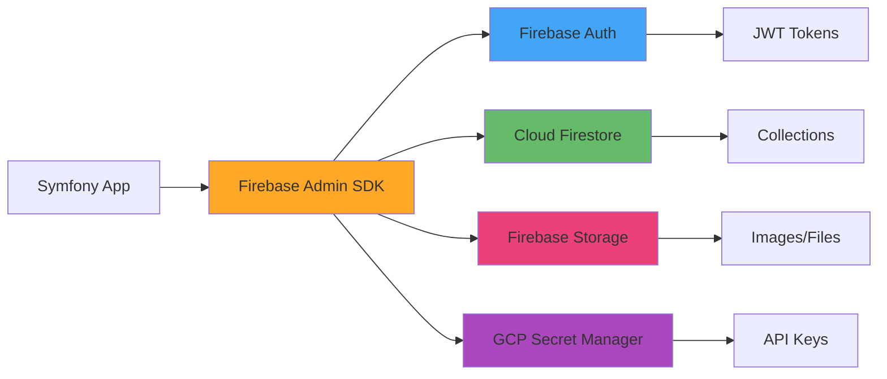
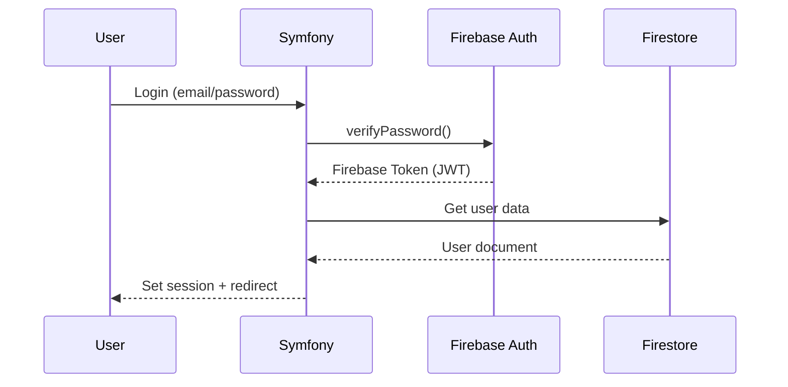

# Guia de Integração com Firebase

Este documento detalha a integração completa do sistema de contatos com Firebase/Google Cloud Platform.

## Índice

1. [Visão Geral](#visão-geral)
2. [Configuração Inicial](#configuração-inicial)
3. [Firebase Authentication](#firebase-authentication)
4. [Cloud Firestore](#cloud-firestore)
5. [Firebase Storage](#firebase-storage)
6. [GCP Secret Manager](#gcp-secret-manager)
7. [Segurança e Regras](#segurança-e-regras)
8. [Exemplos de Código](#exemplos-de-código)
9. [Troubleshooting](#troubleshooting)

## Visão Geral

O sistema utilizará os seguintes serviços Firebase/GCP:



### Por que Firebase?

- ✅ **Escalabilidade automática**: Sem gerenciamento de servidores
- ✅ **Realtime**: Updates em tempo real sem polling
- ✅ **Geo-queries**: Busca por localização nativa
- ✅ **Segurança**: Rules declarativas no Firestore
- ✅ **Custo**: Pay-as-you-go, sem custo fixo
- ✅ **Infraestrutura**: Totalmente gerenciada

## Configuração Inicial

### 1. Criar Projeto Firebase

```bash
# Instalar Firebase CLI
npm install -g firebase-tools

# Login no Firebase
firebase login

# Criar novo projeto (ou usar existente)
firebase projects:create contatos-app

# Listar projetos
firebase projects:list
```

### 2. Habilitar Serviços no Console

Acesse [Firebase Console](https://console.firebase.google.com) e habilite:

1. **Authentication**
   - Email/Password
   - Google Sign-In
   - Phone Authentication (opcional)

2. **Firestore Database**
   - Modo: Native mode
   - Localização: southamerica-east1 (São Paulo)

3. **Storage**
   - Localização: southamerica-east1

4. **Secret Manager** (via GCP Console)
   - Habilitar API do Secret Manager

### 3. Instalar Firebase Admin SDK

```bash
composer require kreait/firebase-php
composer require google/cloud-firestore
composer require google/cloud-secret-manager
```

### 4. Configurar Service Account

```bash
# Criar service account no GCP Console
# IAM & Admin > Service Accounts > Create Service Account

# Permissões necessárias:
# - Firebase Admin
# - Cloud Datastore User
# - Storage Object Admin
# - Secret Manager Secret Accessor

# Baixar chave JSON
# Actions > Manage Keys > Add Key > JSON
# Salvar como: config/firebase-adminsdk.json
```

### 5. Configuração no Symfony

```yaml
# config/packages/firebase.yaml
firebase:
    credentials: '%kernel.project_dir%/config/firebase-adminsdk.json'
    project_id: 'contatos-app'
    database_url: 'https://contatos-app.firebaseio.com'
    storage_bucket: 'contatos-app.appspot.com'
```

```php
// config/services.yaml
services:
    Kreait\Firebase\Factory:
        arguments:
            - '%env(resolve:FIREBASE_CREDENTIALS)%'
    
    Kreait\Firebase\Auth:
        factory: ['@Kreait\Firebase\Factory', 'createAuth']
    
    Kreait\Firebase\Firestore:
        factory: ['@Kreait\Firebase\Factory', 'createFirestore']
    
    Kreait\Firebase\Storage:
        factory: ['@Kreait\Firebase\Factory', 'createStorage']
```

```env
# .env
FIREBASE_CREDENTIALS="${FIREBASE_CREDENTIALS_PATH}"
FIREBASE_PROJECT_ID=contatos-app
FIREBASE_DATABASE_URL=https://contatos-app.firebaseio.com
FIREBASE_STORAGE_BUCKET=contatos-app.appspot.com
```

## Firebase Authentication

### Estrutura de Autenticação



### Implementação do Adapter

```php
namespace App\Infrastructure\Firebase\Auth;

use Kreait\Firebase\Auth as FirebaseAuth;
use Kreait\Firebase\Auth\SignIn\FailedToSignIn;
use App\Domain\User\ValueObject\Email;
use App\Domain\User\ValueObject\Password;

final class FirebaseAuthAdapter
{
    public function __construct(
        private FirebaseAuth $auth
    ) {}
    
    public function signInWithEmailAndPassword(
        Email $email,
        Password $password
    ): FirebaseUserToken {
        try {
            $signInResult = $this->auth->signInWithEmailAndPassword(
                $email->value(),
                $password->value()
            );
            
            return new FirebaseUserToken(
                $signInResult->idToken(),
                $signInResult->firebaseUserId(),
                $signInResult->data()
            );
        } catch (FailedToSignIn $e) {
            throw new InvalidCredentialsException(
                'Invalid email or password',
                previous: $e
            );
        }
    }
    
    public function createUser(
        Email $email,
        Password $password,
        string $displayName
    ): string {
        $userProperties = [
            'email' => $email->value(),
            'password' => $password->value(),
            'displayName' => $displayName,
            'emailVerified' => false,
        ];
        
        $createdUser = $this->auth->createUser($userProperties);
        
        return $createdUser->uid;
    }
    
    public function verifyIdToken(string $idToken): FirebaseUserToken
    {
        try {
            $verifiedToken = $this->auth->verifyIdToken($idToken);
            
            return new FirebaseUserToken(
                $idToken,
                $verifiedToken->claims()->get('sub'),
                $verifiedToken->claims()->all()
            );
        } catch (\Exception $e) {
            throw new InvalidTokenException('Invalid or expired token', previous: $e);
        }
    }
    
    public function deleteUser(string $uid): void
    {
        $this->auth->deleteUser($uid);
    }
    
    public function sendPasswordResetEmail(Email $email): void
    {
        $this->auth->sendPasswordResetLink($email->value());
    }
}
```

### Guard Authenticator para Symfony

```php
namespace App\Infrastructure\Firebase\Security;

use Symfony\Component\HttpFoundation\Request;
use Symfony\Component\HttpFoundation\Response;
use Symfony\Component\Security\Core\Authentication\Token\TokenInterface;
use Symfony\Component\Security\Core\Exception\AuthenticationException;
use Symfony\Component\Security\Http\Authenticator\AbstractAuthenticator;
use Symfony\Component\Security\Http\Authenticator\Passport\Badge\UserBadge;
use Symfony\Component\Security\Http\Authenticator\Passport\Passport;
use Symfony\Component\Security\Http\Authenticator\Passport\SelfValidatingPassport;

final class FirebaseAuthenticator extends AbstractAuthenticator
{
    public function __construct(
        private FirebaseAuthAdapter $firebaseAuth
    ) {}
    
    public function supports(Request $request): ?bool
    {
        return $request->headers->has('Authorization') 
            && str_starts_with($request->headers->get('Authorization'), 'Bearer ');
    }
    
    public function authenticate(Request $request): Passport
    {
        $token = substr($request->headers->get('Authorization'), 7);
        
        $firebaseToken = $this->firebaseAuth->verifyIdToken($token);
        
        return new SelfValidatingPassport(
            new UserBadge($firebaseToken->uid())
        );
    }
    
    public function onAuthenticationSuccess(
        Request $request, 
        TokenInterface $token, 
        string $firewallName
    ): ?Response {
        return null; // Continue with request
    }
    
    public function onAuthenticationFailure(
        Request $request, 
        AuthenticationException $exception
    ): ?Response {
        return new JsonResponse([
            'error' => 'Authentication failed',
            'message' => $exception->getMessage()
        ], Response::HTTP_UNAUTHORIZED);
    }
}
```

## Cloud Firestore

### Estrutura de Coleções

```
firestore/
├── users/
│   └── {userId}/                    # UID do Firebase Auth
│       ├── email: string
│       ├── displayName: string
│       ├── photoURL: string
│       ├── createdAt: timestamp
│       ├── updatedAt: timestamp
│       └── subscription/            # Subcoleção
│           └── {subscriptionId}/
│               ├── plan: string
│               ├── status: string
│               └── expiresAt: timestamp
│
├── contacts/
│   └── {contactId}/                 # UUID gerado
│       ├── userId: string           # Referência ao dono
│       ├── name: string
│       ├── email: string
│       ├── phone: string
│       ├── photoURL: string
│       ├── notes: string
│       ├── categoryId: string
│       ├── location: geopoint       # Para queries geoespaciais
│       ├── address: map
│       │   ├── street: string
│       │   ├── city: string
│       │   ├── state: string
│       │   └── zipCode: string
│       ├── createdAt: timestamp
│       └── updatedAt: timestamp
│
├── categories/
│   └── {categoryId}/
│       ├── name: string
│       ├── color: string
│       ├── icon: string
│       └── userId: string
│
└── audit_logs/                      # Para auditoria
    └── {logId}/
        ├── userId: string
        ├── action: string
        ├── resourceType: string
        ├── resourceId: string
        ├── timestamp: timestamp
        └── metadata: map
```

### Indexes Necessários

```javascript
// firestore.indexes.json
{
  "indexes": [
    {
      "collectionGroup": "contacts",
      "queryScope": "COLLECTION",
      "fields": [
        { "fieldPath": "userId", "order": "ASCENDING" },
        { "fieldPath": "createdAt", "order": "DESCENDING" }
      ]
    },
    {
      "collectionGroup": "contacts",
      "queryScope": "COLLECTION",
      "fields": [
        { "fieldPath": "userId", "order": "ASCENDING" },
        { "fieldPath": "categoryId", "order": "ASCENDING" },
        { "fieldPath": "name", "order": "ASCENDING" }
      ]
    },
    {
      "collectionGroup": "contacts",
      "queryScope": "COLLECTION",
      "fields": [
        { "fieldPath": "userId", "order": "ASCENDING" },
        { "fieldPath": "location", "mode": "ASCENDING" }
      ]
    }
  ],
  "fieldOverrides": []
}
```

Deploy dos indexes:
```bash
firebase deploy --only firestore:indexes
```

### Repository Implementation

```php
namespace App\Infrastructure\Firebase\Firestore;

use App\Domain\Contact\Entity\Contact;
use App\Domain\Contact\Repository\ContactRepositoryInterface;
use Google\Cloud\Firestore\FirestoreClient;

final class FirestoreContactRepository implements ContactRepositoryInterface
{
    private const COLLECTION = 'contacts';
    
    public function __construct(
        private FirestoreClient $firestore,
        private ContactFirestoreMapper $mapper
    ) {}
    
    public function save(Contact $contact): void
    {
        $data = $this->mapper->toFirestore($contact);
        
        $this->firestore
            ->collection(self::COLLECTION)
            ->document($contact->id()->value())
            ->set($data, ['merge' => true]);
    }
    
    public function findById(ContactId $id): ?Contact
    {
        $snapshot = $this->firestore
            ->collection(self::COLLECTION)
            ->document($id->value())
            ->snapshot();
        
        if (!$snapshot->exists()) {
            return null;
        }
        
        return $this->mapper->toDomain($snapshot->data(), $snapshot->id());
    }
    
    public function findByUser(UserId $userId, int $limit = 50): array
    {
        $query = $this->firestore
            ->collection(self::COLLECTION)
            ->where('userId', '=', $userId->value())
            ->orderBy('createdAt', 'DESC')
            ->limit($limit);
        
        $documents = $query->documents();
        
        $contacts = [];
        foreach ($documents as $document) {
            $contacts[] = $this->mapper->toDomain(
                $document->data(), 
                $document->id()
            );
        }
        
        return $contacts;
    }
    
    public function findNearby(
        UserId $userId,
        GeoPoint $center,
        float $radiusKm
    ): array {
        // Usar geohash para queries geoespaciais
        $bounds = $this->calculateGeohashBounds($center, $radiusKm);
        
        $query = $this->firestore
            ->collection(self::COLLECTION)
            ->where('userId', '=', $userId->value())
            ->where('geohash', '>=', $bounds['lower'])
            ->where('geohash', '<=', $bounds['upper']);
        
        $documents = $query->documents();
        
        // Filtrar por distância exata (Firestore retorna aproximação)
        $contacts = [];
        foreach ($documents as $document) {
            $contact = $this->mapper->toDomain($document->data(), $document->id());
            
            if ($this->isWithinRadius($contact->location(), $center, $radiusKm)) {
                $contacts[] = $contact;
            }
        }
        
        return $contacts;
    }
    
    public function delete(ContactId $id): void
    {
        $this->firestore
            ->collection(self::COLLECTION)
            ->document($id->value())
            ->delete();
    }
    
    public function searchByName(UserId $userId, string $term): array
    {
        // Firestore não tem full-text search nativo
        // Opções:
        // 1. Usar Algolia/Elasticsearch (recomendado para produção)
        // 2. Usar array-contains para busca simples
        // 3. Implementar trigram search
        
        $query = $this->firestore
            ->collection(self::COLLECTION)
            ->where('userId', '=', $userId->value())
            ->where('searchTerms', 'array-contains', strtolower($term))
            ->limit(20);
        
        $documents = $query->documents();
        
        $contacts = [];
        foreach ($documents as $document) {
            $contacts[] = $this->mapper->toDomain(
                $document->data(), 
                $document->id()
            );
        }
        
        return $contacts;
    }
}
```

### Mapper para Conversão

```php
namespace App\Infrastructure\Firebase\Firestore\Mapper;

use App\Domain\Contact\Entity\Contact;
use Google\Cloud\Core\Timestamp;
use Google\Cloud\Firestore\GeoPoint;

final class ContactFirestoreMapper
{
    public function toFirestore(Contact $contact): array
    {
        $data = [
            'userId' => $contact->userId()->value(),
            'name' => $contact->name()->value(),
            'email' => $contact->email()->value(),
            'phone' => $contact->phone()?->value(),
            'categoryId' => $contact->categoryId()?->value(),
            'notes' => $contact->notes(),
            'updatedAt' => new Timestamp(new \DateTime()),
        ];
        
        if ($contact->location()) {
            $data['location'] = new GeoPoint(
                $contact->location()->latitude(),
                $contact->location()->longitude()
            );
            $data['geohash'] = $this->calculateGeohash(
                $contact->location()
            );
        }
        
        if ($contact->address()) {
            $data['address'] = [
                'street' => $contact->address()->street(),
                'city' => $contact->address()->city(),
                'state' => $contact->address()->state(),
                'zipCode' => $contact->address()->zipCode(),
            ];
        }
        
        // Para busca por nome (workaround do full-text search)
        $data['searchTerms'] = $this->generateSearchTerms($contact->name()->value());
        
        if (!$contact->exists()) {
            $data['createdAt'] = new Timestamp(new \DateTime());
        }
        
        return $data;
    }
    
    public function toDomain(array $data, string $id): Contact
    {
        return Contact::fromPrimitives(
            id: $id,
            userId: $data['userId'],
            name: $data['name'],
            email: $data['email'],
            phone: $data['phone'] ?? null,
            categoryId: $data['categoryId'] ?? null,
            notes: $data['notes'] ?? null,
            location: isset($data['location']) 
                ? [
                    'latitude' => $data['location']->latitude(),
                    'longitude' => $data['location']->longitude()
                  ]
                : null,
            address: $data['address'] ?? null,
            createdAt: $data['createdAt']->get()->format('c'),
            updatedAt: $data['updatedAt']->get()->format('c')
        );
    }
    
    private function generateSearchTerms(string $name): array
    {
        $terms = [];
        $words = explode(' ', strtolower($name));
        
        foreach ($words as $word) {
            // Adicionar prefixos para busca parcial
            for ($i = 1; $i <= strlen($word); $i++) {
                $terms[] = substr($word, 0, $i);
            }
        }
        
        return array_unique($terms);
    }
    
    private function calculateGeohash(GeoLocation $location): string
    {
        // Implementar algoritmo geohash
        // Ou usar biblioteca: composer require lyrobin/geohash
        return Geohash::encode(
            $location->latitude(), 
            $location->longitude(),
            8 // precisão
        );
    }
}
```

## Firebase Storage

### Estrutura de Storage

```
storage/
├── users/
│   └── {userId}/
│       └── profile/
│           └── avatar.jpg
│
├── contacts/
│   └── {userId}/
│       └── {contactId}/
│           ├── photo.jpg
│           └── documents/
│               └── file.pdf
│
└── temp/
    └── uploads/
        └── {uuid}.tmp
```

### Storage Adapter

```php
namespace App\Infrastructure\Firebase\Storage;

use Kreait\Firebase\Storage;
use Kreait\Firebase\Storage\StorageObject;

final class FirebaseStorageAdapter
{
    private const BUCKET = 'contatos-app.appspot.com';
    
    public function __construct(
        private Storage $storage
    ) {}
    
    public function uploadContactPhoto(
        string $userId,
        string $contactId,
        string $localPath,
        string $mimeType
    ): string {
        $bucket = $this->storage->getBucket(self::BUCKET);
        
        $fileName = sprintf(
            'contacts/%s/%s/photo.%s',
            $userId,
            $contactId,
            $this->getExtensionFromMimeType($mimeType)
        );
        
        $file = fopen($localPath, 'r');
        
        $object = $bucket->upload($file, [
            'name' => $fileName,
            'metadata' => [
                'contentType' => $mimeType,
                'cacheControl' => 'public, max-age=31536000',
            ]
        ]);
        
        // Gerar URL pública (ou assinada)
        return $this->getPublicUrl($fileName);
    }
    
    public function deleteContactPhoto(
        string $userId,
        string $contactId
    ): void {
        $bucket = $this->storage->getBucket(self::BUCKET);
        
        $fileName = sprintf('contacts/%s/%s/', $userId, $contactId);
        
        $objects = $bucket->objects(['prefix' => $fileName]);
        
        foreach ($objects as $object) {
            $object->delete();
        }
    }
    
    public function getSignedUrl(
        string $fileName,
        int $expirationMinutes = 60
    ): string {
        $bucket = $this->storage->getBucket(self::BUCKET);
        $object = $bucket->object($fileName);
        
        $expiration = new \DateTime();
        $expiration->modify("+{$expirationMinutes} minutes");
        
        return $object->signedUrl($expiration);
    }
    
    public function getPublicUrl(string $fileName): string
    {
        return sprintf(
            'https://storage.googleapis.com/%s/%s',
            self::BUCKET,
            $fileName
        );
    }
    
    private function getExtensionFromMimeType(string $mimeType): string
    {
        return match($mimeType) {
            'image/jpeg' => 'jpg',
            'image/png' => 'png',
            'image/webp' => 'webp',
            'image/gif' => 'gif',
            default => 'bin',
        };
    }
}
```

### Upload Controller

```php
namespace App\Presentation\Web\Controller\Contact;

use Symfony\Component\HttpFoundation\File\UploadedFile;
use Symfony\Component\HttpFoundation\Request;

final class ContactPhotoController extends AbstractController
{
    public function __construct(
        private FirebaseStorageAdapter $storage
    ) {}
    
    #[Route('/contacts/{id}/photo', methods: ['POST'])]
    public function upload(string $id, Request $request): Response
    {
        /** @var UploadedFile $file */
        $file = $request->files->get('photo');
        
        if (!$file) {
            throw new BadRequestException('No file uploaded');
        }
        
        // Validar tipo e tamanho
        if (!in_array($file->getMimeType(), ['image/jpeg', 'image/png'])) {
            throw new BadRequestException('Invalid file type');
        }
        
        if ($file->getSize() > 5 * 1024 * 1024) { // 5MB
            throw new BadRequestException('File too large');
        }
        
        $userId = $this->getUser()->getId();
        
        $photoUrl = $this->storage->uploadContactPhoto(
            $userId,
            $id,
            $file->getPathname(),
            $file->getMimeType()
        );
        
        // Atualizar contato com nova URL
        // ... (via use case)
        
        return $this->json(['photoUrl' => $photoUrl]);
    }
}
```

## GCP Secret Manager

### Configuração

```php
namespace App\Infrastructure\GCP\SecretManager;

use Google\Cloud\SecretManager\V1\SecretManagerServiceClient;

final class SecretManagerAdapter
{
    private SecretManagerServiceClient $client;
    private string $projectId;
    
    public function __construct(string $projectId)
    {
        $this->client = new SecretManagerServiceClient();
        $this->projectId = $projectId;
    }
    
    public function getSecret(string $secretName, string $version = 'latest'): string
    {
        $name = $this->client->secretVersionName(
            $this->projectId,
            $secretName,
            $version
        );
        
        $response = $this->client->accessSecretVersion($name);
        
        return $response->getPayload()->getData();
    }
    
    public function createSecret(string $secretName, string $secretValue): void
    {
        $parent = $this->client->projectName($this->projectId);
        
        // Criar secret
        $secret = $this->client->createSecret($parent, $secretName, [
            'replication' => [
                'automatic' => []
            ]
        ]);
        
        // Adicionar versão com valor
        $this->client->addSecretVersion($secret->getName(), [
            'data' => $secretValue
        ]);
    }
}
```

### Uso no Symfony

```yaml
# config/services.yaml
parameters:
    env(ASAAS_API_KEY): '%secret_manager.get("asaas-api-key")%'
    env(FIREBASE_PRIVATE_KEY): '%secret_manager.get("firebase-private-key")%'

services:
    secret_manager:
        class: App\Infrastructure\GCP\SecretManager\SecretManagerAdapter
        arguments:
            - '%env(GCP_PROJECT_ID)%'
```

## Segurança e Regras

### Firestore Security Rules

```javascript
// firestore.rules
rules_version = '2';
service cloud.firestore {
  match /databases/{database}/documents {
    
    // Helper functions
    function isAuthenticated() {
      return request.auth != null;
    }
    
    function isOwner(userId) {
      return isAuthenticated() && request.auth.uid == userId;
    }
    
    // Users collection
    match /users/{userId} {
      allow read: if isOwner(userId);
      allow create: if isOwner(userId);
      allow update: if isOwner(userId);
      allow delete: if false; // Não permitir delete de usuários
      
      // Subcoleção de subscription
      match /subscription/{subscriptionId} {
        allow read, write: if isOwner(userId);
      }
    }
    
    // Contacts collection
    match /contacts/{contactId} {
      allow read: if isAuthenticated() && 
                     resource.data.userId == request.auth.uid;
      
      allow create: if isAuthenticated() && 
                       request.resource.data.userId == request.auth.uid &&
                       request.resource.data.name is string &&
                       request.resource.data.email is string &&
                       request.resource.data.email.matches('[a-zA-Z0-9._%+-]+@[a-zA-Z0-9.-]+\\.[a-zA-Z]{2,}');
      
      allow update: if isAuthenticated() && 
                       resource.data.userId == request.auth.uid &&
                       request.resource.data.userId == resource.data.userId; // Não permitir mudar dono
      
      allow delete: if isAuthenticated() && 
                       resource.data.userId == request.auth.uid;
    }
    
    // Categories collection
    match /categories/{categoryId} {
      allow read, write: if isAuthenticated() && 
                            resource.data.userId == request.auth.uid;
    }
    
    // Audit logs - somente leitura para admins
    match /audit_logs/{logId} {
      allow read: if false; // Desabilitado para usuários
      allow write: if false; // Apenas server-side pode escrever
    }
  }
}
```

Deploy das rules:
```bash
firebase deploy --only firestore:rules
```

### Storage Security Rules

```javascript
// storage.rules
rules_version = '2';
service firebase.storage {
  match /b/{bucket}/o {
    
    // Helper functions
    function isAuthenticated() {
      return request.auth != null;
    }
    
    function isImage() {
      return request.resource.contentType.matches('image/.*');
    }
    
    function isSizeValid(maxSizeMB) {
      return request.resource.size < maxSizeMB * 1024 * 1024;
    }
    
    // Contacts photos
    match /contacts/{userId}/{contactId}/{fileName} {
      allow read: if isAuthenticated() && 
                     request.auth.uid == userId;
      
      allow write: if isAuthenticated() && 
                      request.auth.uid == userId &&
                      isImage() &&
                      isSizeValid(5);
      
      allow delete: if isAuthenticated() && 
                       request.auth.uid == userId;
    }
    
    // User profile photos
    match /users/{userId}/profile/{fileName} {
      allow read: if isAuthenticated();
      
      allow write: if isAuthenticated() && 
                      request.auth.uid == userId &&
                      isImage() &&
                      isSizeValid(2);
    }
    
    // Temporary uploads
    match /temp/uploads/{fileName} {
      allow write: if isAuthenticated() && isSizeValid(10);
      allow read, delete: if false;
    }
  }
}
```

## Exemplos de Queries

### Query Simples

```php
// Buscar todos os contatos de um usuário
$contacts = $firestore
    ->collection('contacts')
    ->where('userId', '=', $userId)
    ->orderBy('name')
    ->documents();
```

### Query com Filtros Múltiplos

```php
// Buscar contatos de uma categoria específica
$contacts = $firestore
    ->collection('contacts')
    ->where('userId', '=', $userId)
    ->where('categoryId', '=', $categoryId)
    ->where('createdAt', '>=', $startDate)
    ->orderBy('createdAt', 'DESC')
    ->limit(20)
    ->documents();
```

### Query Geoespacial

```php
// Buscar contatos próximos (raio de 5km)
$center = new GeoPoint(-23.5505, -46.6333); // São Paulo
$radiusKm = 5;

// Calcular bounds do geohash
$bounds = calculateGeohashBounds($center, $radiusKm);

$contacts = $firestore
    ->collection('contacts')
    ->where('userId', '=', $userId)
    ->where('geohash', '>=', $bounds['lower'])
    ->where('geohash', '<=', $bounds['upper'])
    ->documents();

// Filtrar por distância exata
$nearbyContacts = array_filter(iterator_to_array($contacts), function($doc) use ($center, $radiusKm) {
    $location = $doc->data()['location'];
    $distance = calculateDistance($center, $location);
    return $distance <= $radiusKm;
});
```

### Paginação

```php
// Primeira página
$query = $firestore
    ->collection('contacts')
    ->where('userId', '=', $userId)
    ->orderBy('createdAt', 'DESC')
    ->limit(20);

$documents = $query->documents();
$lastDoc = null;

foreach ($documents as $doc) {
    $lastDoc = $doc;
    // processar...
}

// Próxima página
if ($lastDoc) {
    $nextQuery = $firestore
        ->collection('contacts')
        ->where('userId', '=', $userId)
        ->orderBy('createdAt', 'DESC')
        ->startAfter($lastDoc)
        ->limit(20);
    
    $nextDocuments = $nextQuery->documents();
}
```

### Batch Operations

```php
// Deletar múltiplos contatos em batch
$batch = $firestore->batch();

foreach ($contactIds as $contactId) {
    $docRef = $firestore->collection('contacts')->document($contactId);
    $batch->delete($docRef);
}

$batch->commit();
```

### Transações

```php
// Transferir contato entre usuários (transação)
$firestore->runTransaction(function (Transaction $transaction) use ($contactId, $newUserId) {
    $contactRef = $this->firestore->collection('contacts')->document($contactId);
    
    $snapshot = $transaction->snapshot($contactRef);
    
    if (!$snapshot->exists()) {
        throw new ContactNotFoundException();
    }
    
    $transaction->update($contactRef, [
        ['path' => 'userId', 'value' => $newUserId],
        ['path' => 'updatedAt', 'value' => new Timestamp(new \DateTime())]
    ]);
});
```

## Troubleshooting

### Erro: "Permission Denied"

**Causa**: Firestore rules bloqueando acesso.

**Solução**:
1. Verificar regras no console: https://console.firebase.google.com/project/_/firestore/rules
2. Testar regras no simulador
3. Verificar se `request.auth.uid` está correto

### Erro: "Missing or insufficient permissions"

**Causa**: Service account sem permissões adequadas.

**Solução**:
```bash
# Adicionar roles ao service account
gcloud projects add-iam-policy-binding PROJECT_ID \
  --member="serviceAccount:firebase-adminsdk@PROJECT_ID.iam.gserviceaccount.com" \
  --role="roles/datastore.user"
```

### Erro: "Index required"

**Causa**: Query requer índice composto.

**Solução**:
1. Firestore mostra link no erro para criar índice automaticamente
2. Ou adicionar manualmente em `firestore.indexes.json` e deploy

### Performance Lenta

**Causas e Soluções**:

1. **Muitos documentos retornados**: Adicionar `.limit()`
2. **Query não usa índice**: Criar índices compostos
3. **Dados grandes**: Separar em subcoleções
4. **Queries geoespaciais lentas**: Usar geohash apropriado (8-9 chars)

### Custos Altos

**Otimizações**:

1. **Reduzir reads**: Cache em Redis/Memcached
2. **Batch operations**: Agrupar writes
3. **Evitar queries em loop**: Usar `whereIn()` com arrays
4. **Monitorar quotas**: Cloud Console > Firestore > Usage

## Monitoramento

### Logs Estruturados

```php
use Psr\Log\LoggerInterface;

$logger->info('Contact created', [
    'userId' => $userId,
    'contactId' => $contactId,
    'source' => 'web',
    'timestamp' => time()
]);
```

### Métricas Customizadas

```php
// Via Cloud Monitoring API
$metric = new Metric();
$metric->setType('custom.googleapis.com/contact/created');
$metric->setPoints([
    [
        'interval' => ['endTime' => time()],
        'value' => ['int64Value' => 1]
    ]
]);
```

## Referências

- [Firebase Admin SDK PHP](https://firebase-php.readthedocs.io/)
- [Cloud Firestore Documentation](https://firebase.google.com/docs/firestore)
- [Firebase Security Rules](https://firebase.google.com/docs/rules)
- [Geohash for proximity search](https://www.movable-type.co.uk/scripts/geohash.html)
- [GCP Secret Manager](https://cloud.google.com/secret-manager/docs)

## Próximos Passos

1. ✅ Setup Firebase project
2. ✅ Configurar service account
3. 📋 Implementar repositories
4. 📋 Configurar security rules
5. 📋 Testes de integração
6. 📋 Deploy inicial
