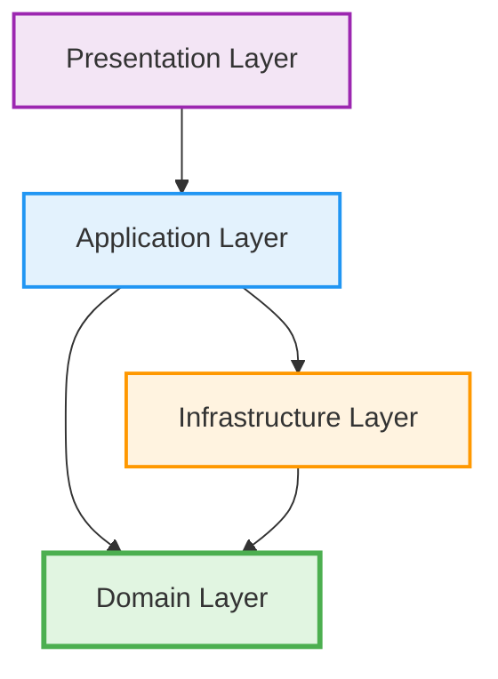
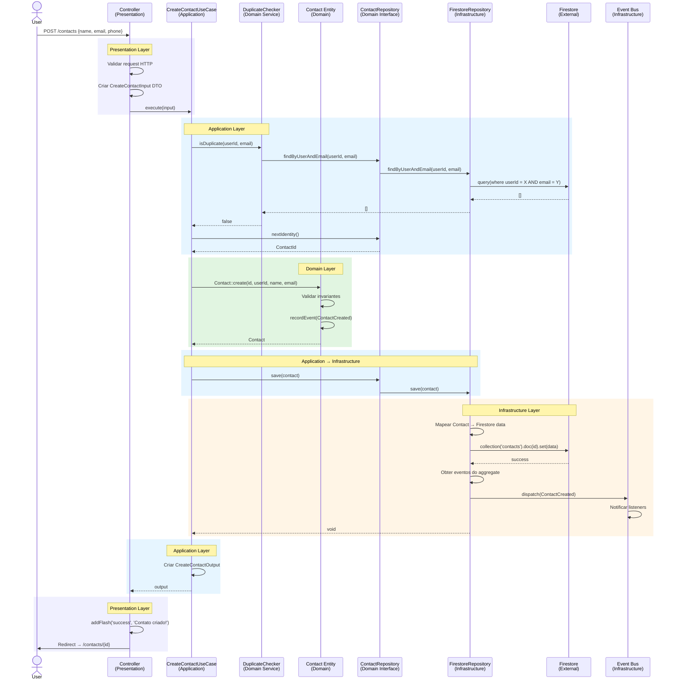
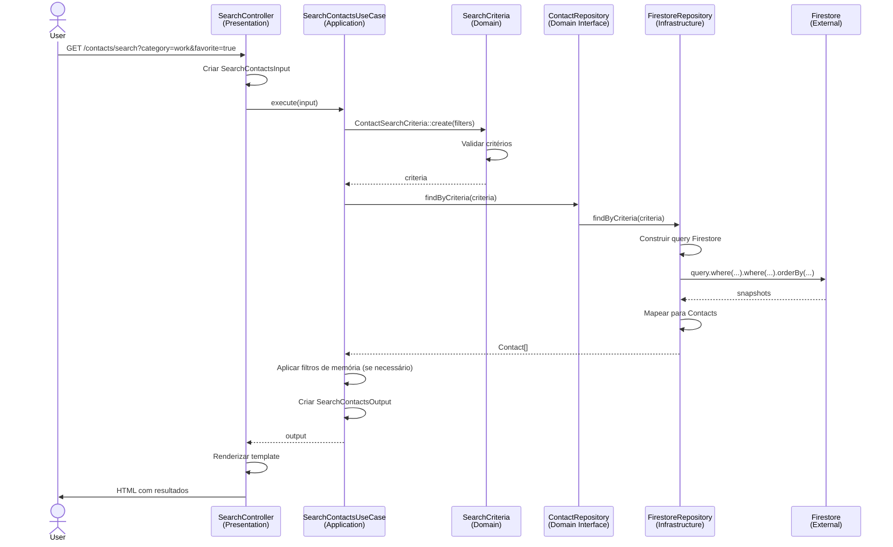
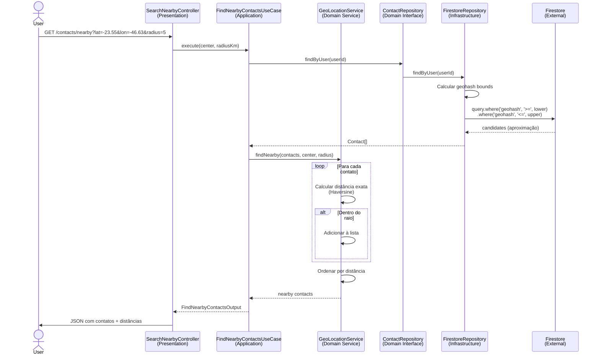
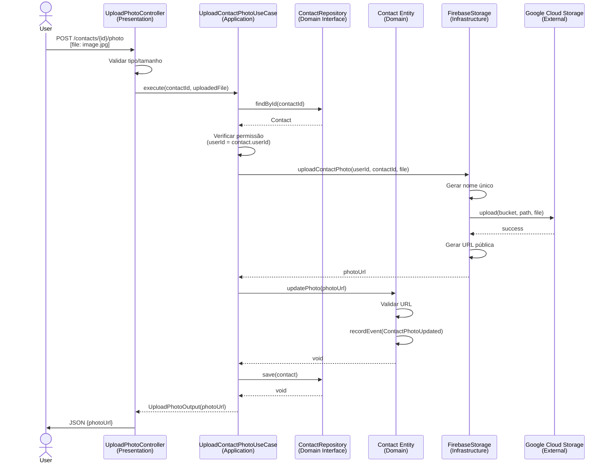
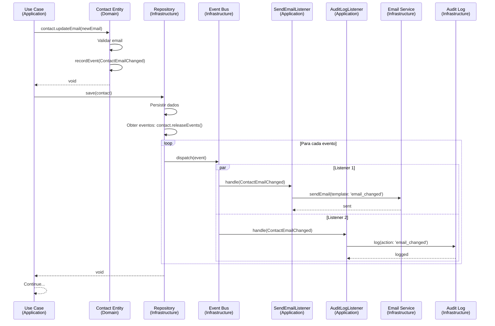
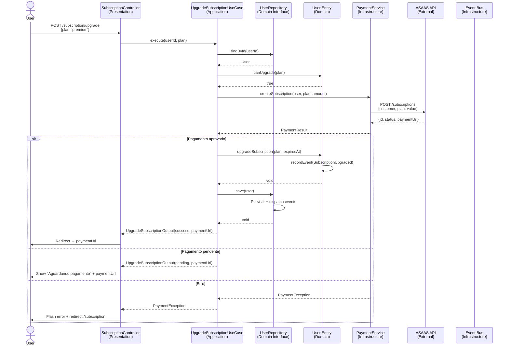

# Fluxos Entre Camadas

Este documento detalha os fluxos de dados e comunicação entre as camadas da arquitetura, com diagramas de sequência e exemplos práticos.

## Índice

1. [Visão Geral dos Fluxos](#visão-geral-dos-fluxos)
2. [Fluxo de Criação de Contato](#fluxo-de-criação-de-contato)
3. [Fluxo de Autenticação Firebase](#fluxo-de-autenticação-firebase)
4. [Fluxo de Busca com Filtros](#fluxo-de-busca-com-filtros)
5. [Fluxo de Busca Geolocalizada](#fluxo-de-busca-geolocalizada)
6. [Fluxo de Upload de Foto](#fluxo-de-upload-de-foto)
7. [Fluxo de Eventos de Domínio](#fluxo-de-eventos-de-domínio)
8. [Fluxo de Pagamento](#fluxo-de-pagamento)
9. [Princípios de Comunicação](#princípios-de-comunicação)
10. [Anti-Patterns](#anti-patterns)

## Visão Geral dos Fluxos

### Direção da Dependência



### Regras Fundamentais

1. **Domain nunca depende de nada** (exceto bibliotecas padrão PHP)
2. **Application orquestra Domain e Infrastructure**
3. **Infrastructure implementa interfaces do Domain**
4. **Presentation só conhece Application**

## Fluxo de Criação de Contato

### Diagrama de Sequência



### Código Passo a Passo

#### 1. Controller recebe Request (Presentation)

```php
namespace App\Presentation\Web\Controller\Contact;

#[Route('/contacts')]
final class ContactController extends AbstractController
{
    public function __construct(
        private CreateContactUseCase $createContact
    ) {}
    
    #[Route('/create', methods: ['POST'])]
    public function create(Request $request): Response
    {
        // Validação HTTP
        if (!$request->request->has('name')) {
            throw new BadRequestException('Name is required');
        }
        
        // Criar DTO (Application Layer)
        $input = new CreateContactInput(
            userId: UserId::fromString($this->getUser()->getId()),
            name: $request->request->get('name'),
            email: $request->request->get('email'),
            phone: $request->request->get('phone')
        );
        
        try {
            // Delegar para Application Layer
            $output = $this->createContact->execute($input);
            
            $this->addFlash('success', 'Contato criado com sucesso!');
            
            return $this->redirectToRoute('contact_show', [
                'id' => $output->id
            ]);
        } catch (DuplicateContactException $e) {
            $this->addFlash('error', 'Contato já existe');
            return $this->redirectToRoute('contact_new');
        }
    }
}
```

#### 2. Use Case orquestra (Application)

```php
namespace App\Application\Contact\UseCase;

final class CreateContactUseCase
{
    public function __construct(
        private ContactRepositoryInterface $repository,
        private ContactDuplicateChecker $duplicateChecker
    ) {}
    
    public function execute(CreateContactInput $input): CreateContactOutput
    {
        // 1. Validar regras de aplicação (não de domínio)
        $email = ContactEmail::fromString($input->email);
        
        // 2. Domain Service: verificar duplicata
        if ($this->duplicateChecker->isDuplicate($input->userId, $email)) {
            throw new DuplicateContactException();
        }
        
        // 3. Gerar ID
        $id = $this->repository->nextIdentity();
        
        // 4. Criar aggregate (Domain)
        $contact = Contact::create(
            $id,
            $input->userId,
            ContactName::fromString($input->name),
            $email,
            $input->phone ? ContactPhone::fromString($input->phone) : null
        );
        
        // 5. Persistir (Infrastructure)
        $this->repository->save($contact);
        
        // 6. Retornar DTO
        return CreateContactOutput::fromContact($contact);
    }
}
```

#### 3. Entity aplica regras de negócio (Domain)

```php
namespace App\Domain\Contact\Entity;

final class Contact extends AggregateRoot
{
    public static function create(
        ContactId $id,
        UserId $userId,
        ContactName $name,
        ContactEmail $email,
        ?ContactPhone $phone
    ): self {
        // Validações de domínio
        if ($name->isEmpty()) {
            throw new DomainException('Name cannot be empty');
        }
        
        $contact = new self();
        $contact->id = $id;
        $contact->userId = $userId;
        $contact->name = $name;
        $contact->email = $email;
        $contact->phone = $phone;
        $contact->createdAt = new \DateTimeImmutable();
        $contact->updatedAt = new \DateTimeImmutable();
        
        // Registrar evento
        $contact->recordEvent(new ContactCreated(
            $id, $userId, $name, $email
        ));
        
        return $contact;
    }
}
```

#### 4. Repository persiste (Infrastructure)

```php
namespace App\Infrastructure\Firebase\Firestore;

final class FirestoreContactRepository implements ContactRepositoryInterface
{
    public function save(Contact $contact): void
    {
        // Mapear Domain → Infrastructure
        $data = $this->mapper->toFirestore($contact);
        
        // Persistir no Firestore
        $this->firestore
            ->collection('contacts')
            ->document($contact->id()->value())
            ->set($data, ['merge' => true]);
        
        // Processar eventos
        foreach ($contact->releaseEvents() as $event) {
            $this->eventBus->dispatch($event);
        }
    }
}
```

## Fluxo de Autenticação Firebase

```mermaid
sequenceDiagram
    actor User
    participant L as LoginController<br/>(Presentation)
    participant UC as AuthenticateUserUseCase<br/>(Application)
    participant FA as FirebaseAuthAdapter<br/>(Infrastructure)
    participant FB as Firebase Auth<br/>(External)
    participant R as UserRepository<br/>(Domain Interface)
    participant RI as FirestoreUserRepository<br/>(Infrastructure)
    participant FS as Firestore<br/>(External)
    participant S as Session<br/>(Symfony)
    
    User->>L: POST /login {email, password}
    L->>UC: execute(email, password)
    
    rect rgb(255, 245, 230)
    Note over UC,FA: Application → Infrastructure
    UC->>FA: signInWithEmailAndPassword(email, password)
    FA->>FB: signInWithEmailAndPassword()
    
    alt Credenciais válidas
        FB-->>FA: FirebaseToken (JWT)
        FA-->>UC: FirebaseUserToken
        
        UC->>R: findByFirebaseUid(token.uid)
        R->>RI: findByFirebaseUid(uid)
        RI->>FS: collection('users').where('firebaseUid', '=', uid).get()
        FS-->>RI: user data
        RI-->>UC: User entity
        
        UC->>UC: Criar AuthenticatedUserOutput
        UC-->>L: output (userId, token)
        
        L->>S: Criar sessão Symfony
        S-->>L: session ID
        L->>User: Redirect → /dashboard
    else Credenciais inválidas
        FB-->>FA: FailedToSignIn exception
        FA-->>UC: InvalidCredentialsException
        UC-->>L: InvalidCredentialsException
        L->>User: Flash error + redirect /login
    end
```

### Código do Fluxo de Autenticação

```php
// Controller (Presentation)
#[Route('/login', methods: ['POST'])]
public function login(Request $request): Response
{
    $input = new AuthenticateUserInput(
        email: $request->request->get('email'),
        password: $request->request->get('password')
    );
    
    try {
        $output = $this->authenticateUser->execute($input);
        
        // Criar sessão Symfony
        $this->session->set('user_id', $output->userId);
        $this->session->set('firebase_token', $output->token);
        
        return $this->redirectToRoute('dashboard');
    } catch (InvalidCredentialsException $e) {
        $this->addFlash('error', 'Email ou senha inválidos');
        return $this->redirectToRoute('login');
    }
}

// Use Case (Application)
final class AuthenticateUserUseCase
{
    public function __construct(
        private FirebaseAuthAdapter $firebaseAuth,
        private UserRepositoryInterface $userRepository
    ) {}
    
    public function execute(AuthenticateUserInput $input): AuthenticatedUserOutput
    {
        // 1. Autenticar no Firebase
        $token = $this->firebaseAuth->signInWithEmailAndPassword(
            Email::fromString($input->email),
            Password::fromString($input->password)
        );
        
        // 2. Buscar usuário no Firestore
        $user = $this->userRepository->findByFirebaseUid($token->uid());
        
        if (!$user) {
            throw new UserNotFoundException();
        }
        
        // 3. Retornar dados
        return new AuthenticatedUserOutput(
            userId: $user->id()->value(),
            token: $token->idToken(),
            displayName: $user->profile()->displayName()
        );
    }
}
```

## Fluxo de Busca com Filtros



### Código de Busca

```php
// Critérios de busca (Domain)
namespace App\Domain\Contact\ValueObject;

final class ContactSearchCriteria
{
    private function __construct(
        private readonly UserId $userId,
        private readonly ?CategoryId $categoryId,
        private readonly ?bool $isFavorite,
        private readonly ?string $nameTerm,
        private readonly ?DateRange $dateRange,
        private readonly int $limit,
        private readonly int $offset
    ) {
        if ($limit < 1 || $limit > 100) {
            throw new InvalidArgumentException('Limit must be between 1 and 100');
        }
    }
    
    public static function create(
        UserId $userId,
        ?CategoryId $categoryId = null,
        ?bool $isFavorite = null,
        ?string $nameTerm = null,
        ?DateRange $dateRange = null,
        int $limit = 50,
        int $offset = 0
    ): self {
        return new self($userId, $categoryId, $isFavorite, $nameTerm, $dateRange, $limit, $offset);
    }
    
    // Getters...
}

// Use Case (Application)
final class SearchContactsUseCase
{
    public function execute(SearchContactsInput $input): SearchContactsOutput
    {
        // Criar critérios
        $criteria = ContactSearchCriteria::create(
            userId: $input->userId,
            categoryId: $input->categoryId,
            isFavorite: $input->isFavorite,
            nameTerm: $input->nameTerm,
            limit: $input->limit ?? 50
        );
        
        // Buscar
        $contacts = $this->repository->findByCriteria($criteria);
        
        // Aplicar ordenação/filtros de memória se necessário
        // (ex: busca fuzzy no nome)
        
        return SearchContactsOutput::fromContacts($contacts, count($contacts));
    }
}

// Repository (Infrastructure)
public function findByCriteria(ContactSearchCriteria $criteria): array
{
    $query = $this->firestore
        ->collection('contacts')
        ->where('userId', '=', $criteria->userId()->value());
    
    // Adicionar filtros
    if ($criteria->categoryId()) {
        $query = $query->where('categoryId', '=', $criteria->categoryId()->value());
    }
    
    if ($criteria->isFavorite() !== null) {
        $query = $query->where('isFavorite', '=', $criteria->isFavorite());
    }
    
    if ($criteria->dateRange()) {
        $query = $query
            ->where('createdAt', '>=', $criteria->dateRange()->start())
            ->where('createdAt', '<=', $criteria->dateRange()->end());
    }
    
    $query = $query
        ->orderBy('createdAt', 'DESC')
        ->limit($criteria->limit())
        ->offset($criteria->offset());
    
    $documents = $query->documents();
    
    return array_map(
        fn($doc) => $this->mapper->toDomain($doc->data(), $doc->id()),
        iterator_to_array($documents)
    );
}
```

## Fluxo de Busca Geolocalizada



### Código de Busca Geolocalizada

```php
// Use Case (Application)
final class FindNearbyContactsUseCase
{
    public function __construct(
        private ContactRepositoryInterface $repository,
        private GeoLocationService $geoService
    ) {}
    
    public function execute(FindNearbyContactsInput $input): FindNearbyContactsOutput
    {
        $center = GeoLocation::fromCoordinates(
            $input->latitude,
            $input->longitude
        );
        
        // Buscar todos os contatos do usuário com localização
        $allContacts = $this->repository->findByUser($input->userId);
        
        // Filtrar apenas com localização
        $contactsWithLocation = array_filter(
            $allContacts,
            fn($c) => $c->location() !== null
        );
        
        // Domain Service: filtrar por proximidade
        $nearby = $this->geoService->findNearby(
            $contactsWithLocation,
            $center,
            $input->radiusKm
        );
        
        return FindNearbyContactsOutput::fromResults($nearby);
    }
}

// Domain Service
final class GeoLocationService
{
    public function findNearby(
        array $contacts,
        GeoLocation $center,
        float $radiusKm
    ): array {
        $nearby = [];
        
        foreach ($contacts as $contact) {
            $distance = $contact->location()->distanceTo($center);
            
            if ($distance <= $radiusKm) {
                $nearby[] = [
                    'contact' => $contact,
                    'distance' => round($distance, 2),
                    'distanceFormatted' => $this->formatDistance($distance)
                ];
            }
        }
        
        usort($nearby, fn($a, $b) => $a['distance'] <=> $b['distance']);
        
        return $nearby;
    }
    
    private function formatDistance(float $km): string
    {
        if ($km < 1) {
            return round($km * 1000) . ' m';
        }
        return round($km, 1) . ' km';
    }
}
```

## Fluxo de Upload de Foto



### Código de Upload

```php
// Controller (Presentation)
#[Route('/contacts/{id}/photo', methods: ['POST'])]
public function uploadPhoto(string $id, Request $request): Response
{
    /** @var UploadedFile $file */
    $file = $request->files->get('photo');
    
    if (!$file) {
        return $this->json(['error' => 'No file uploaded'], 400);
    }
    
    // Validação HTTP
    $allowedTypes = ['image/jpeg', 'image/png', 'image/webp'];
    if (!in_array($file->getMimeType(), $allowedTypes)) {
        return $this->json(['error' => 'Invalid file type'], 400);
    }
    
    if ($file->getSize() > 5 * 1024 * 1024) { // 5MB
        return $this->json(['error' => 'File too large'], 400);
    }
    
    try {
        $output = $this->uploadPhoto->execute(
            new UploadContactPhotoInput(
                contactId: ContactId::fromString($id),
                userId: UserId::fromString($this->getUser()->getId()),
                filePath: $file->getPathname(),
                mimeType: $file->getMimeType()
            )
        );
        
        return $this->json(['photoUrl' => $output->photoUrl]);
    } catch (UnauthorizedException $e) {
        return $this->json(['error' => 'Unauthorized'], 403);
    }
}

// Use Case (Application)
final class UploadContactPhotoUseCase
{
    public function __construct(
        private ContactRepositoryInterface $repository,
        private FirebaseStorageAdapter $storage
    ) {}
    
    public function execute(UploadContactPhotoInput $input): UploadContactPhotoOutput
    {
        // 1. Buscar contato
        $contact = $this->repository->findById($input->contactId);
        
        if (!$contact) {
            throw new ContactNotFoundException();
        }
        
        // 2. Verificar permissão
        if (!$contact->userId()->equals($input->userId)) {
            throw new UnauthorizedException('Not your contact');
        }
        
        // 3. Upload para Firebase Storage
        $photoUrl = $this->storage->uploadContactPhoto(
            $input->userId->value(),
            $input->contactId->value(),
            $input->filePath,
            $input->mimeType
        );
        
        // 4. Atualizar entity
        $contact->updatePhoto(PhotoUrl::fromString($photoUrl));
        
        // 5. Salvar
        $this->repository->save($contact);
        
        return new UploadContactPhotoOutput($photoUrl);
    }
}
```

## Fluxo de Eventos de Domínio



### Código de Eventos

```php
// Entity registra evento (Domain)
public function updateEmail(ContactEmail $newEmail): void
{
    if ($this->email->equals($newEmail)) {
        return;
    }
    
    $oldEmail = $this->email;
    $this->email = $newEmail;
    $this->updatedAt = new \DateTimeImmutable();
    
    $this->recordEvent(new ContactEmailChanged(
        $this->id,
        $oldEmail,
        $newEmail
    ));
}

// Repository despacha eventos (Infrastructure)
public function save(Contact $contact): void
{
    // 1. Persistir
    $data = $this->mapper->toFirestore($contact);
    $this->firestore->collection('contacts')
        ->document($contact->id()->value())
        ->set($data, ['merge' => true]);
    
    // 2. Processar eventos
    foreach ($contact->releaseEvents() as $event) {
        $this->eventBus->dispatch($event);
    }
}

// Listener de email (Application)
final class SendEmailOnContactEmailChanged
{
    public function __construct(
        private EmailService $emailService
    ) {}
    
    public function __invoke(ContactEmailChanged $event): void
    {
        $this->emailService->send(
            to: $event->newEmail()->value(),
            subject: 'Email atualizado',
            template: 'contact_email_changed',
            data: [
                'contactId' => $event->contactId()->value(),
                'oldEmail' => $event->oldEmail()->value()
            ]
        );
    }
}

// Listener de auditoria (Application)
final class LogContactChanges
{
    public function __construct(
        private AuditLogService $auditLog
    ) {}
    
    public function __invoke(ContactEmailChanged $event): void
    {
        $this->auditLog->log(
            action: 'contact_email_changed',
            resourceType: 'contact',
            resourceId: $event->contactId()->value(),
            metadata: [
                'oldEmail' => $event->oldEmail()->value(),
                'newEmail' => $event->newEmail()->value(),
                'timestamp' => $event->occurredOn()->format('c')
            ]
        );
    }
}
```

## Fluxo de Pagamento



### Código de Pagamento

```php
// Use Case (Application)
final class UpgradeSubscriptionUseCase
{
    public function execute(UpgradeSubscriptionInput $input): UpgradeSubscriptionOutput
    {
        // 1. Buscar usuário
        $user = $this->userRepository->findById($input->userId);
        
        // 2. Verificar se pode fazer upgrade
        if (!$user->canUpgradeToplan($input->plan)) {
            throw new CannotUpgradeException('Already has active subscription');
        }
        
        // 3. Criar assinatura no ASAAS
        $paymentResult = $this->paymentService->createSubscription(
            customerId: $user->id()->value(),
            customerEmail: $user->email()->value(),
            plan: $input->plan,
            amount: $this->getAmountForPlan($input->plan)
        );
        
        // 4. Se aprovado, atualizar aggregate
        if ($paymentResult->isApproved()) {
            $expiresAt = new \DateTimeImmutable('+1 month');
            
            $user->upgradeSubscription(
                SubscriptionPlan::fromString($input->plan),
                $expiresAt
            );
            
            $this->userRepository->save($user);
        }
        
        return new UpgradeSubscriptionOutput(
            success: $paymentResult->isApproved(),
            status: $paymentResult->status(),
            paymentUrl: $paymentResult->paymentUrl()
        );
    }
}

// Payment Service (Infrastructure)
final class ASAASPaymentService implements PaymentServiceInterface
{
    public function createSubscription(
        string $customerId,
        string $customerEmail,
        string $plan,
        Money $amount
    ): PaymentResult {
        $response = $this->httpClient->post('/subscriptions', [
            'customer' => $customerId,
            'billingType' => 'CREDIT_CARD',
            'value' => $amount->asFloat(),
            'cycle' => 'MONTHLY',
            'description' => "Plano {$plan}"
        ]);
        
        return PaymentResult::fromASAASResponse($response);
    }
}
```

## Princípios de Comunicação

### 1. Dependency Inversion

```php
// ✅ CORRETO: Application depende de interface do Domain
namespace App\Application\Contact\UseCase;

use App\Domain\Contact\Repository\ContactRepositoryInterface; // Interface do Domain

final class CreateContactUseCase
{
    public function __construct(
        private ContactRepositoryInterface $repository // Tipo do Domain
    ) {}
}

// ❌ ERRADO: Application depende de implementação
use App\Infrastructure\Firebase\FirestoreContactRepository; // Implementação

final class CreateContactUseCase
{
    public function __construct(
        private FirestoreContactRepository $repository // ❌ Acoplamento direto
    ) {}
}
```

### 2. DTOs para Atravessar Camadas

```php
// Input DTO (Application Layer)
final class CreateContactInput
{
    public function __construct(
        public readonly UserId $userId,
        public readonly string $name,
        public readonly string $email,
        public readonly ?string $phone
    ) {}
}

// Output DTO (Application Layer)
final class CreateContactOutput
{
    public function __construct(
        public readonly string $id,
        public readonly string $name,
        public readonly string $email,
        public readonly string $createdAt
    ) {}
    
    public static function fromContact(Contact $contact): self
    {
        return new self(
            $contact->id()->value(),
            $contact->name()->value(),
            $contact->email()->value(),
            $contact->createdAt()->format('c')
        );
    }
}
```

### 3. Eventos para Comunicação Assíncrona

```php
// Domain registra evento
$contact->recordEvent(new ContactCreated($id, $userId));

// Infrastructure despacha
foreach ($contact->releaseEvents() as $event) {
    $this->eventBus->dispatch($event);
}

// Application escuta
final class SendWelcomeEmailListener
{
    public function __invoke(ContactCreated $event): void
    {
        // Side effect assíncrono
    }
}
```

### 4. Repository Abstrai Persistência

```php
// Domain define contrato
interface ContactRepositoryInterface
{
    public function save(Contact $contact): void;
    public function findById(ContactId $id): ?Contact;
}

// Infrastructure implementa
final class FirestoreContactRepository implements ContactRepositoryInterface
{
    public function save(Contact $contact): void
    {
        // Detalhes de Firestore aqui
    }
}

// Application usa interface
final class CreateContactUseCase
{
    public function __construct(
        private ContactRepositoryInterface $repository
    ) {}
}
```

## Anti-Patterns

### ❌ 1. Domain Chamando Infrastructure

```php
// ❌ ERRADO: Entity conhece Firestore
namespace App\Domain\Contact\Entity;

use Google\Cloud\Firestore\FirestoreClient; // ❌

final class Contact
{
    public function save(FirestoreClient $firestore): void // ❌
    {
        $firestore->collection('contacts')->document($this->id)->set([...]); // ❌
    }
}

// ✅ CORRETO: Repository no Infrastructure
$this->repository->save($contact);
```

### ❌ 2. Controller Chamando Múltiplos Repositories

```php
// ❌ ERRADO: Orquestração no Controller
final class ContactController
{
    public function create(Request $request): Response
    {
        $contact = Contact::create(...); // ❌ Lógica no controller
        $this->contactRepository->save($contact); // ❌
        
        $user = $this->userRepository->findById($userId); // ❌
        $user->incrementContactCount(); // ❌
        $this->userRepository->save($user); // ❌
        
        $this->emailService->send(...); // ❌
    }
}

// ✅ CORRETO: Use Case orquestra
final class CreateContactUseCase
{
    public function execute(CreateContactInput $input): CreateContactOutput
    {
        // Orquestração aqui
    }
}
```

### ❌ 3. Entities Anêmicas

```php
// ❌ ERRADO: Apenas getters/setters
final class Contact
{
    public function setName(string $name): void
    {
        $this->name = $name;
    }
}

// ✅ CORRETO: Métodos de negócio
final class Contact
{
    public function updateBasicInfo(
        ContactName $name,
        ContactEmail $email
    ): void {
        // Validações
        // Eventos
        // Lógica
    }
}
```

### ❌ 4. Lógica de Negócio no Application Layer

```php
// ❌ ERRADO: Regras no Use Case
final class CreateContactUseCase
{
    public function execute(CreateContactInput $input): CreateContactOutput
    {
        // ❌ Validação de negócio no Application
        if (strlen($input->name) > 100) {
            throw new Exception('Name too long');
        }
        
        $contact = new Contact(); // ❌ Sem factory method
        $contact->name = $input->name; // ❌ Sem encapsulamento
    }
}

// ✅ CORRETO: Regras no Domain
final class Contact
{
    public static function create(
        ContactId $id,
        ContactName $name, // ❌ Value Object valida
        ...
    ): self {
        // Validações e invariantes aqui
    }
}
```

## Resumo dos Fluxos

| Fluxo | Camadas Envolvidas | Tempo Típico |
|-------|-------------------|--------------|
| Criar Contato | Presentation → Application → Domain → Infrastructure | ~100-200ms |
| Autenticação | Presentation → Application → Infrastructure (Firebase) | ~300-500ms |
| Busca com Filtros | Presentation → Application → Infrastructure (Firestore) | ~50-150ms |
| Busca Geolocalizada | Application → Domain Service → Infrastructure | ~200-400ms |
| Upload de Foto | Presentation → Application → Infrastructure (Storage) | ~500ms-2s |
| Processar Eventos | Infrastructure → Application (listeners) | Assíncrono |
| Pagamento | Application → Infrastructure (ASAAS) → External API | ~1-3s |

## Checklist de Revisão de Fluxo

Ao implementar um novo fluxo, verificar:

- [ ] Controller apenas valida HTTP e delega para Use Case
- [ ] Use Case orquestra, não contém lógica de negócio
- [ ] Lógica de negócio está no Domain (Entities, Value Objects, Services)
- [ ] Repository interface no Domain, implementação no Infrastructure
- [ ] DTOs usados para entrada/saída do Application Layer
- [ ] Domain Events para comunicação assíncrona
- [ ] Nenhuma dependência do Domain para outras camadas
- [ ] Testes de cada camada isoladamente

## Referências

- [Hexagonal Architecture](https://alistair.cockburn.us/hexagonal-architecture/)
- [Clean Architecture Layers](https://blog.cleancoder.com/uncle-bob/2012/08/13/the-clean-architecture.html)
- [DDD Layers](https://www.domainlanguage.com/ddd/)

## Próximos Passos

1. ✅ Entender fluxos entre camadas
2. 📋 Implementar primeiro fluxo (Create Contact)
3. 📋 Adicionar testes para cada camada
4. 📋 Implementar eventos de domínio
5. 📋 Adicionar mais fluxos complexos
